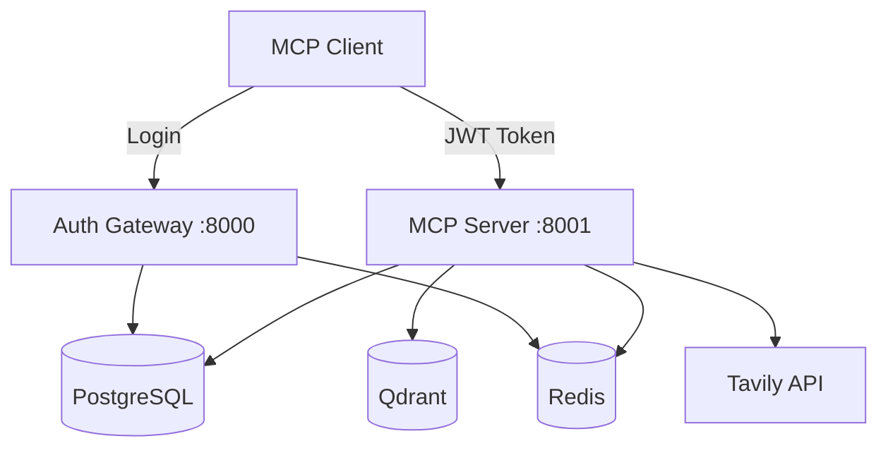

# MCP for Retriever

웹 검색, 벡터 데이터베이스, 관계형 데이터베이스를 통합하며  
인증/인가(Authentication/Authorization) 기능을 제공하는  
MCP(Model Context Protocol) 서버입니다.

## 🚀 빠른 시작

### 필수 요구사항

- **Docker Compose**: 모든 서비스는 Docker Compose로 실행됩니다
- **Tavily API Key**: [https://tavily.com](https://tavily.com)에서 발급 (무료)

### Docker로 실행하기

```bash
# 1. 환경 설정
cp .env.example .env
# .env 파일에서 TAVILY_API_KEY 설정 필수

# 2. 모든 서비스 시작
./scripts/start-docker.sh --build

# 3. 서비스 상태 확인
./scripts/test-services.sh
```

> **중요**: 이 프로젝트는 Docker Compose로만 실행됩니다. 모든 데이터베이스와 서비스가 컨테이너로 관리됩니다.

## 📋 주요 기능

### 검색 기능

- **웹 검색**: Tavily API를 통한 웹 콘텐츠 검색
- **벡터 검색**: Qdrant를 통한 의미론적 검색
- **데이터베이스 검색**: PostgreSQL 전문 검색
- **통합 검색**: 모든 소스에서 동시 검색

### 보안 및 관리

- **JWT 인증**: 역할 기반 접근 제어 (RBAC)
- **토큰 관리**: 리프레시 토큰 무효화 및 세션 관리 ✨ NEW
- **Admin UI**: FastHTML 기반 관리자 대시보드
- **API 보안**: Bearer Token 인증

### 성능 및 모니터링

- **Redis 캐싱**: 검색 결과 캐싱
- **비동기 처리**: Python asyncio 기반
- **관찰성**: OpenTelemetry + Sentry 통합
- **헬스 체크**: 모든 서비스 상태 모니터링

## 🏗️ 아키텍처



### 서비스 구성

| 서비스 | 포트 | 설명 |
|--------|------|------|
| Auth Gateway | 8000 | 인증/인가, Admin UI |
| MCP Server | 8001 | MCP 도구 제공 |
| PostgreSQL | 5432 | 사용자 데이터, 콘텐츠 |
| Qdrant | 6333/6334 | 벡터 검색 엔진 |
| Redis | 6379 | 캐시, 세션, 토큰 저장소 |

## 🔐 인증 플로우

### 1. 사용자 등록 및 로그인

```bash
# 등록
curl -X POST http://localhost:8000/auth/register \
  -H "Content-Type: application/json" \
  -d '{"email": "user@example.com", "password": "Password123!"}'

# 로그인 (JWT 토큰 획득)
curl -X POST http://localhost:8000/auth/login \
  -H "Content-Type: application/json" \
  -d '{"email": "user@example.com", "password": "Password123!"}'
```

### 2. MCP 클라이언트 설정

```json
{
  "mcpServers": {
    "mcp-retriever": {
      "url": "http://localhost:8001/",
      "transport": "http",
      "auth": {
        "type": "bearer",
        "token": "YOUR_JWT_TOKEN_HERE"
      }
    }
  }
}
```

## 🛠️ 사용 가능한 도구

- `search_web`: Tavily 웹 검색
- `search_vectors`: Qdrant 벡터 검색  
- `search_database`: PostgreSQL 검색
- `search_all`: 모든 소스 통합 검색
- `health_check`: 서비스 상태 확인

## 👨‍💼 Admin UI

### 관리자 기능

- **대시보드**: 시스템 통계 및 빠른 액션
- **사용자 관리**: 사용자 목록, 권한 설정
- **세션 관리**: 활성 세션 모니터링, 토큰 무효화 ✨ NEW
- **권한 관리**: RBAC 설정
- **역할 관리**: 역할 생성 및 권한 할당

### 접속 방법

1. 관리자 계정으로 로그인
2. <http://localhost:8000/admin> 접속

## 🆕 토큰 무효화 기능

### 주요 기능

- **세션 추적**: Redis 기반 리프레시 토큰 저장소
- **개별 무효화**: 특정 토큰/디바이스 무효화
- **전체 무효화**: 사용자의 모든 세션 종료
- **Admin UI 통합**: 웹 인터페이스로 세션 관리

### API 엔드포인트

```bash
# 사용자 세션 조회
GET /api/v1/admin/users/{user_id}/sessions

# 토큰 무효화
POST /api/v1/admin/users/{user_id}/revoke-tokens
POST /api/v1/admin/tokens/revoke/{jti}

# 모든 활성 세션 조회
GET /api/v1/admin/sessions/active
```

## 🧪 테스트

### Docker 환경에서 테스트

```bash
# 통합 테스트 실행
./scripts/run-integration-tests.sh

# 특정 테스트 실행
docker exec -it mcp-server pytest tests/unit/test_token_revocation.py

# 전체 테스트 스위트 실행
docker exec -it mcp-server pytest tests/
```

## 📝 환경 설정

### 초기 설정 가이드

1. **환경 변수 파일 생성**

   ```bash
   cp .env.example .env
   ```

2. **필수 API 키 설정**
   - `TAVILY_API_KEY`: [Tavily](https://tavily.com)에서 무료 API 키 발급
   - 나머지 키는 자동 생성됨 (수정 불필요)

3. **Docker Compose 환경 변수** (자동 설정)

   ```bash
   # 서비스 URL - Docker 네트워크에서 자동 설정
   AUTH_GATEWAY_URL=http://auth-gateway:8000
   MCP_SERVER_URL=http://mcp-server:8001
   
   # 데이터베이스 호스트 - 컨테이너 이름으로 자동 설정
   POSTGRES_HOST=postgres
   QDRANT_HOST=qdrant
   REDIS_HOST=redis
   ```

### 서버 프로파일

Docker 환경에서는 자동으로 `COMPLETE` 프로파일이 적용되어 모든 기능이 활성화됩니다:

- JWT 인증 및 권한 관리
- 컨텍스트 추적
- Redis 캐싱
- 속도 제한
- 성능 메트릭

## 🚀 배포

### Docker 운영 명령어

```bash
# 서비스 시작/중지
./scripts/start-docker.sh
./scripts/stop-docker.sh

# 로그 확인
./scripts/logs-docker.sh -f
./scripts/logs-docker.sh mcp-server -f

# 컨테이너 접속
docker exec -it mcp-postgres psql -U mcp_user -d mcp_retriever
docker exec -it mcp-redis redis-cli
```

## 📈 프로젝트 현황

### 기능

- 모든 검색 도구 (웹, 벡터, 데이터베이스)
- JWT 기반 인증 시스템
- Redis 캐싱 레이어
- Docker Compose 환경
- OpenTelemetry + Sentry 통합
- 토큰 무효화 및 세션 관리 ✨ NEW
- FastHTML Admin UI
- 190개 이상의 테스트
- 🔐 리프레시 토큰 무효화 기능 추가
- 🖥️ Admin UI에 세션 관리 페이지 통합
- 📊 활성 세션 모니터링 및 관리 API
- 🚀 통합 서버 프로파일 시스템

## 라이선스

MIT
