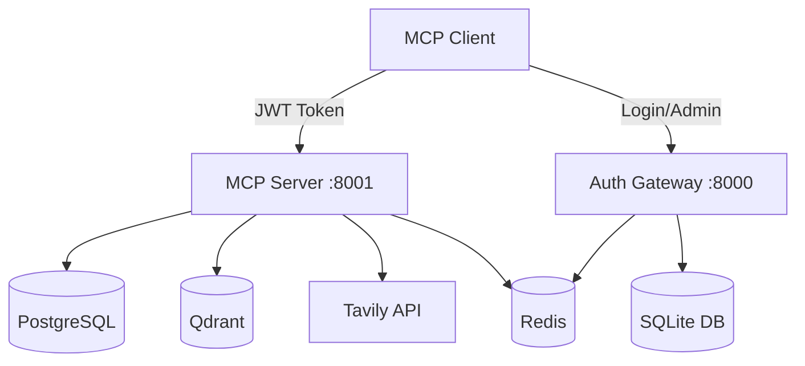

# MCP for Retriever

웹 검색, 벡터 데이터베이스(Qdrant), 관계형 데이터베이스(PostgreSQL)를 통합하며  
인증/인가(Authentication/Authorization) 기능을 제공하는 MCP(Model Context Protocol) 서버입니다.

## 라이선스

[MIT](./LICENSE) 라이선스에 따라 배포됩니다.

## 🚀 빠른 시작

### 필수 요구사항

- **Docker**: 모든 서비스는 Docker(Compose)로 실행됩니다.
- **Tavily API Key**: [https://tavily.com](https://tavily.com)에서 발급 (무료)

### Docker로 실행하기

```bash
# 1. 환경 설정
cp .env.example .env
# .env 파일에서 TAVILY_API_KEY 설정 필수

# 2. 모든 서비스 시작
./scripts/start-docker.sh --build

# 3. 서비스 상태 확인
./scripts/test-services.sh
```

> 이 프로젝트는 Docker Compose로만 실행되도록 구성했습니다. (MCP - Streamable HTTP만 지원하도록 목표함)  
> 그래서 모든 데이터베이스와 서비스가 컨테이너로 관리됩니다.

## 📋 주요 기능

### 검색 기능

- **웹 검색**: Tavily API를 통한 웹 콘텐츠 검색
- **벡터 검색**: Qdrant를 통한 의미론적 검색
- **데이터베이스 검색**: PostgreSQL 전문 검색
- **통합 검색**: 모든 소스에서 동시 검색

### 관리자 대시보드

- **JWT 인증**: 역할 기반 접근 제어 (RBAC)
- **사용자/세션 관리**: 토큰 무효화 및 권한 관리
- **📊 분석 대시보드**: Chart.js 기반 시각적 메트릭 ✨ NEW
- **📤 데이터 내보내기**: CSV/JSON 형태 데이터 추출 ✨ NEW
- **🌍 국제화**: 한국어/영어 지원 ✨ NEW
- **🔔 실시간 알림**: SSE 기반 시스템 이벤트 알림 ✨ NEW

### 성능 및 모니터링

- **Redis 캐싱**: 검색 결과 캐싱
- **비동기 처리**: Python asyncio 기반
- **관찰성**: OpenTelemetry + Sentry 통합
- **헬스 체크**: 모든 서비스 상태 모니터링

## 🏗️ 아키텍처



### 서비스 구성

| 서비스 | 포트 | 데이터베이스 | 설명 |
|--------|------|-------------|------|
| Auth Gateway | 8000 | SQLite | 인증/인가, Admin UI |
| MCP Server | 8001 | PostgreSQL | MCP 도구 제공 |
| PostgreSQL | 5432 | - | 검색 데이터, 콘텐츠 저장 |
| Qdrant | 6333/6334 | - | 벡터 검색 엔진 |
| Redis | 6379 | - | 캐시, 세션, 토큰 저장소 |

## 🔐 인증 플로우

### 1. 사용자 등록 및 로그인

```bash
# 등록
curl -X POST http://localhost:8000/auth/register \
  -H "Content-Type: application/json" \
  -d '{"email": "user@example.com", "password": "Password123!"}'

# 로그인 (JWT 토큰 획득)
curl -X POST http://localhost:8000/auth/login \
  -H "Content-Type: application/json" \
  -d '{"email": "user@example.com", "password": "Password123!"}'
```

### 2. MCP 클라이언트 설정

```json
{
  "mcpServers": {
    "mcp-retriever": {
      "url": "http://localhost:8001/",
      "transport": "http",
      "auth": {
        "type": "bearer",
        "token": "YOUR_JWT_TOKEN_HERE"
      }
    }
  }
}
```

## 🛠️ 사용 가능한 도구

- `search_web`: Tavily 웹 검색
- `search_vectors`: Qdrant 벡터 검색  
- `search_database`: PostgreSQL 검색
- `search_all`: 모든 소스 통합 검색
- `health_check`: 서비스 상태 확인

## 👨‍💼 Admin UI

### 📋 개요

FastHTML + HTMX 기반의 현대적인 관리자 인터페이스

**핵심 특징:**

- 🎨 **Tailwind CSS** + **HTMX** 반응형 디자인
- 🔐 **JWT 인증** 및 **RBAC** 권한 관리
- 📊 **실시간 분석** 및 **데이터 내보내기** ✨ NEW
- 🌍 **다국어 지원** (한국어/영어) ✨ NEW
- 🔔 **실시간 알림** (SSE 기반) ✨ NEW
- 🧩 **14개 재사용 컴포넌트** 라이브러리

### 🎯 관리자 기능

#### 1. **대시보드** (`/admin`)

- 시스템 통계 카드 (사용자, 세션, 권한 수)
- 빠른 액션 버튼

#### 2. **사용자 관리** (`/admin/users`)

- 사용자 목록 및 역할 관리
- 권한 보기 및 역할 변경

#### 3. **세션 관리** (`/admin/sessions`)

- 활성 JWT 토큰 목록
- 개별/일괄 토큰 무효화

#### 4. **권한 관리** (`/admin/permissions`)

- 권한 목록 및 실시간 필터링
- 리소스별 권한 생성/삭제
- 와일드카드 패턴 지원

#### 5. **역할 관리** (`/admin/roles`)

- 역할-권한 매트릭스
- 역할 편집 및 관리

#### 6. **분석 대시보드** (`/admin/analytics`) ✨ NEW

- **Chart.js 시각화**: 도구 사용량, 응답시간 분포
- **메트릭 테이블**: 정렬 가능한 상세 통계
- **자동 새로고침**: HTMX 기반 실시간 업데이트

#### 7. **데이터 내보내기** ✨ NEW

- **사용자 데이터**: `/admin/export/users.csv`
- **권한 데이터**: `/admin/export/permissions.csv`
- **메트릭 데이터**: `/admin/export/metrics.json`

#### 8. **언어 설정** ✨ NEW

- **언어 전환**: 상단 LanguageSelector 드롭다운
- **세션 유지**: 브라우저 재시작 후에도 언어 설정 유지
- **전체 번역**: 200개 이상 UI 요소 번역

#### 9. **실시간 알림** ✨ NEW

- **SSE 스트림**: `/admin/events` 엔드포인트
- **시스템 이벤트**: 오류, 사용자 액션 실시간 알림
- **HTMX 통합**: JavaScript 없는 실시간 업데이트

### 🔐 권한 관리 시스템 (RBAC)

#### 역할 기반 접근 제어

MCP Retriever는 완전한 **RBAC(Role-Based Access Control)** 시스템을 구현합니다:

```python
# 기본 역할 구조
admin:    # 모든 권한 (웹검색, 벡터DB, 데이터베이스 R/W)
├─ user:  # 제한된 권한 (웹검색 R, 벡터DB R/W, 데이터베이스 R/W)
└─ guest: # 읽기 전용 (웹검색 R만)

# 별칭 역할
viewer → guest   # 읽기 전용 사용자
analyst → user   # 분석가 (user와 동일한 권한)
```

#### 리소스 타입 및 권한

| 리소스 타입 | 설명 | 지원 액션 |
|-------------|------|-----------|
| `web_search` | Tavily 웹 검색 API | READ |
| `vector_db` | Qdrant 벡터 데이터베이스 | READ, WRITE |
| `database` | PostgreSQL 데이터베이스 | READ, WRITE, DELETE |

#### 도구별 권한 매트릭스

| 도구 | guest | user | admin | 설명 |
|------|-------|------|-------|------|
| `health_check` | ✅ | ✅ | ✅ | 모든 사용자 접근 가능 |
| `search_web` | ❌ | ✅ | ✅ | 웹 검색 권한 필요 |
| `search_vectors` | ❌ | ✅ | ✅ | 벡터 DB 쓰기 권한 필요 |
| `search_database` | ❌ | ✅ | ✅ | 데이터베이스 쓰기 권한 필요 |
| `search_all` | ❌ | ❌ | ✅ | 모든 리소스 읽기 권한 필요 |

### 🚀 기본 관리자 계정

Docker 시작 시 자동으로 생성되는 기본 계정:

| 항목 | 기본값 | 환경변수 |
|------|--------|----------|
| **이메일** | `admin@example.com` | `ADMIN_EMAIL` |
| **비밀번호** | `Admin123!` | `ADMIN_PASSWORD` |
| **사용자명** | `System Admin` | `ADMIN_USERNAME` |
| **자동 생성** | `true` | `AUTO_CREATE_ADMIN` |

### 📱 접속 및 사용법

#### 1. 관리자 로그인

```bash
# 1. Auth Gateway 로그인 페이지 접속
open http://localhost:8000/auth/login-page

# 2. 기본 관리자 계정으로 로그인
이메일: admin@example.com
비밀번호: Admin123!

# 3. Admin UI 접속
open http://localhost:8000/admin
```

#### 2. API를 통한 접근

```bash
# JWT 토큰 획득
TOKEN=$(curl -s -X POST "http://localhost:8000/auth/login" \
  -H "Content-Type: application/json" \
  -d '{"email": "admin@example.com", "password": "Admin123!"}' | \
  jq -r '.access_token')

# Admin API 호출
curl -H "Authorization: Bearer $TOKEN" \
  "http://localhost:8000/api/v1/admin/users"
```

### 🛠️ 관리자 계정 커스터마이즈

환경 변수로 초기 관리자 계정을 설정할 수 있습니다:

```bash
# .env 파일에서 설정
AUTO_CREATE_ADMIN=true                    # 자동 생성 여부
ADMIN_EMAIL=admin@yourdomain.com          # 관리자 이메일
ADMIN_PASSWORD=YourSecurePassword123!     # 관리자 비밀번호  
ADMIN_USERNAME=Your Admin Name            # 관리자 이름
```

## 🔗 주요 API 엔드포인트

### 인증 및 관리

```bash
# 인증
POST /auth/login
POST /auth/register

# 세션 관리
GET /api/v1/admin/sessions/active
POST /api/v1/admin/users/{user_id}/revoke-tokens

# 데이터 내보내기 ✨ NEW
GET /admin/export/users.csv
GET /admin/export/permissions.csv
GET /admin/export/metrics.json

# 분석 및 알림 ✨ NEW
GET /admin/analytics
GET /admin/events (SSE)

# 언어 설정 ✨ NEW
POST /admin/change-language
```

## 🧪 테스트

### 완비된 테스트 시스템

- **총 테스트**: 250개 이상 ✨ 확장
- **E2E 테스트**: Playwright 기반 Admin UI 자동화
- **단위 테스트**: 77개 컴포넌트 테스트 (기존 38개 + 새로 추가 39개) ✨ NEW
- **통합 테스트**: Docker 환경 기반 전체 시스템 검증

### 🎭 E2E 테스트 확장 ✨ NEW

새로 추가된 4개 테스트 파일 (43개 테스트):

- `test_analytics_dashboard.py` - 분석 대시보드 시각화 테스트
- `test_data_export.py` - CSV/JSON 내보내기 검증
- `test_internationalization.py` - 다국어 전환 테스트
- `test_real_time_notifications.py` - SSE 실시간 알림 테스트

### 🧩 컴포넌트 단위 테스트 확장 ✨ NEW

새로 추가된 5개 컴포넌트 테스트 (39개 테스트):

- `TestAnalyticsChart` - Chart.js 렌더링 검증
- `TestExportButton` - 데이터 내보내기 버튼 테스트
- `TestMetricsTable` - 메트릭 테이블 기능 검증
- `TestNotificationBanner` - 실시간 알림 표시 테스트
- `TestLanguageSelector` - 언어 선택 드롭다운 테스트

### 테스트 실행

```bash
# 전체 테스트 실행
./scripts/run-integration-tests.sh

# E2E 테스트 실행
./scripts/run-e2e-tests.sh

# 새로운 기능 테스트만 실행
docker exec -it mcp-server pytest tests/e2e/test_analytics_dashboard.py -v
docker exec -it mcp-server pytest tests/unit/test_auth/test_components.py::TestAnalyticsChart -v
```

## 📝 환경 설정

### 초기 설정 가이드

1. **환경 변수 파일 생성**

   ```bash
   cp .env.example .env
   ```

2. **필수 API 키 설정**
   - `TAVILY_API_KEY`: [Tavily](https://tavily.com)에서 무료 API 키 발급
   - 나머지 키는 자동 생성됨 (수정 불필요)

3. **Docker Compose 환경 변수** (자동 설정)

   ```bash
   # 서비스 URL - Docker 네트워크에서 자동 설정
   AUTH_GATEWAY_URL=http://auth-gateway:8000
   MCP_SERVER_URL=http://mcp-server:8001
   
   # 데이터베이스 호스트 - 컨테이너 이름으로 자동 설정
   POSTGRES_HOST=postgres
   QDRANT_HOST=qdrant
   REDIS_HOST=redis
   ```

### 서버 프로파일

Docker 환경에서는 자동으로 `COMPLETE` 프로파일이 적용되어 모든 기능이 활성화됩니다:

- JWT 인증 및 권한 관리
- 컨텍스트 추적
- Redis 캐싱
- 속도 제한
- 성능 메트릭

## 🚀 배포

### Docker 운영 명령어

```bash
# 서비스 시작/중지
./scripts/start-docker.sh
./scripts/stop-docker.sh

# 로그 확인
./scripts/logs-docker.sh -f
./scripts/logs-docker.sh mcp-server -f

# 컨테이너 접속
docker exec -it mcp-postgres psql -U mcp_user -d mcp_retriever
docker exec -it mcp-redis redis-cli
```

## 📈 프로젝트 현황

### 🔍 검색 및 데이터 처리

- 통합 검색 (웹/벡터/데이터베이스)
- Redis 캐싱 및 비동기 처리

### 🔐 보안 및 인증

- JWT + RBAC 권한 관리
- 세션 추적 및 토큰 무효화

### 🖥️ Admin UI (FastHTML + HTMX)

- **14개 재사용 컴포넌트** (기존 9개 + 확장 5개) ✨ 확장
- **분석 대시보드** (Chart.js 시각화) ✨ NEW
- **데이터 내보내기** (CSV/JSON) ✨ NEW
- **다국어 지원** (한국어/영어) ✨ NEW
- **실시간 알림** (SSE 기반) ✨ NEW

### 🧪 테스트 및 품질 보증

- **250개 이상 테스트** (기존 220개 → 확장) ✨ 확장
- **77개 컴포넌트 단위 테스트** (38개 → 77개) ✨ 확장
- **43개 E2E 테스트 추가** (새 기능 자동화) ✨ NEW
- Docker 통합 테스트 완비

### 🚀 인프라 및 배포

- Docker Compose 완전 컨테이너화
- 통합 서버 프로파일 및 헬스 체크
- 자동화 스크립트 (배포/테스트/로그)
