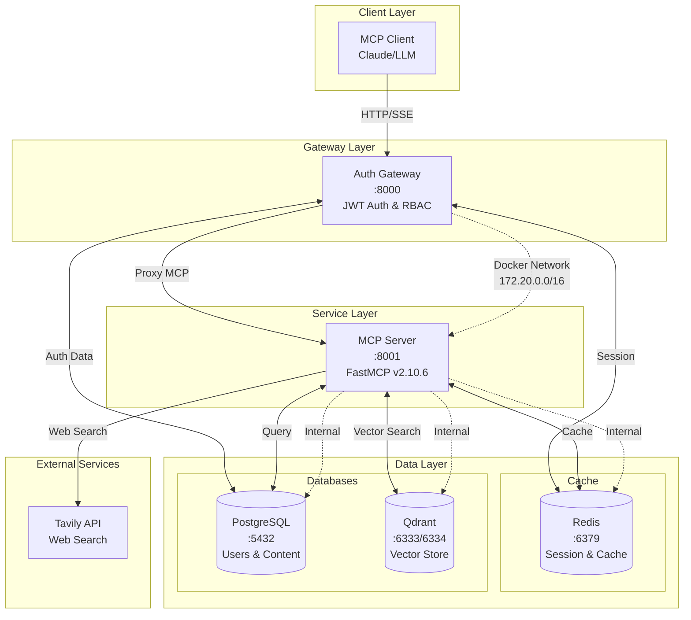
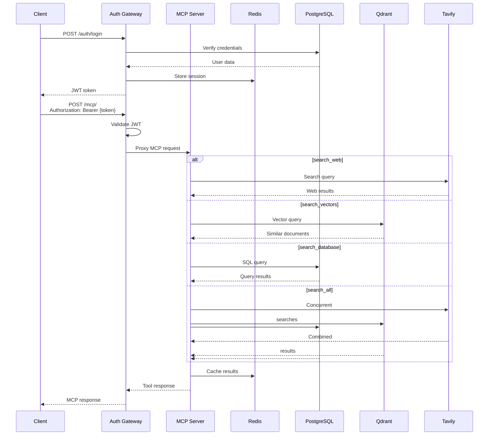
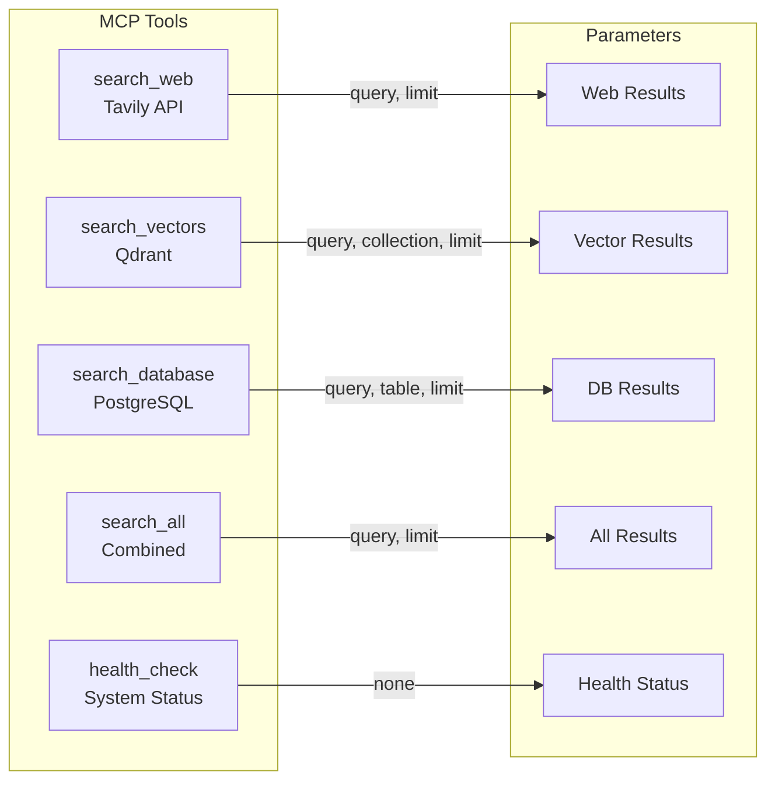
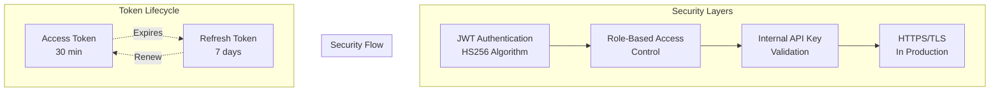

# MCP Server Complete Architecture

## System Overview

MCP Server for Retriever는 다양한 데이터 소스(Web Search, Vector DB, RDB)를 통합하여 MCP(Model Context Protocol)를 통해 제공하는 마이크로서비스 아키텍처 시스템입니다.

## Architecture Diagram



## Component Details

### 1. Auth Gateway (Port 8000)
- **Technology**: FastAPI + Uvicorn
- **Features**:
  - JWT 기반 인증 (HS256)
  - 역할 기반 접근 제어 (RBAC)
  - MCP 요청 프록시
  - 사용자 관리 API
  - 상태 체크: `/health`

### 2. MCP Server (Port 8001)
- **Technology**: FastMCP v2.10.6
- **Transport**: Streamable HTTP
- **Features**:
  - 통합 검색 도구 제공
  - 컨텍스트 추적
  - 캐싱 지원
  - 구조화된 로깅

### 3. PostgreSQL (Port 5432)
- **Version**: 17-alpine
- **Database**: mcp_retriever
- **Functions**:
  - 사용자 인증 정보
  - 콘텐츠 저장소
  - 전문 검색 지원

### 4. Qdrant (Port 6333/6334)
- **Version**: latest
- **Functions**:
  - 벡터 임베딩 저장
  - 시맨틱 검색
  - gRPC 인터페이스 (6334)

### 5. Redis (Port 6379)
- **Version**: latest
- **Functions**:
  - 세션 관리
  - 검색 결과 캐싱
  - 분산 잠금

## Docker Compose Configuration

```yaml
services:
  postgres:
    image: postgres:17-alpine
    container_name: mcp-postgres
    healthcheck:
      test: ["CMD-SHELL", "pg_isready -U mcp_user -d mcp_retriever"]
    
  qdrant:
    image: qdrant/qdrant:latest
    container_name: mcp-qdrant
    ports:
      - "6333:6333"  # HTTP
      - "6334:6334"  # gRPC
    
  redis:
    image: redis:latest
    container_name: mcp-redis
    healthcheck:
      test: ["CMD", "redis-cli", "ping"]
    
  auth-gateway:
    build: ./docker/Dockerfile.auth
    container_name: mcp-auth-gateway
    depends_on:
      postgres:
        condition: service_healthy
      redis:
        condition: service_healthy
    
  mcp-server:
    build: ./docker/Dockerfile.mcp
    container_name: mcp-server
    environment:
      MCP_PROFILE: DEV
      MCP_TRANSPORT: http
    depends_on:
      auth-gateway:
        condition: service_healthy

networks:
  mcp-network:
    driver: bridge
    ipam:
      config:
        - subnet: 172.20.0.0/16
```

## API Flow



## MCP Tools Available



## Security Architecture



## Deployment Status

### ✅ Successfully Deployed Services
1. **PostgreSQL**: Healthy, initialized with schema
2. **Qdrant**: Running, ready for vector operations
3. **Redis**: Healthy, accepting connections
4. **Auth Gateway**: Healthy, JWT auth operational
5. **MCP Server**: Healthy, all tools available

### 🔧 Configuration Used
- **Profile**: DEV (development mode)
- **Transport**: HTTP (Streamable)
- **Rate Limiting**: Disabled for development
- **Caching**: Enabled with Redis
- **Authentication**: JWT with internal API key

### 📊 Resource Allocation
- **Network**: Bridge network (172.20.0.0/16)
- **Volumes**: Persistent storage for all databases
- **Health Checks**: Configured for all services
- **Restart Policy**: unless-stopped

## Monitoring and Observability

```mermaid
graph LR
    subgraph "Logging"
        SL[Structured Logging<br/>JSON Format]
        RL[Request Logging<br/>with Request ID]
        EL[Error Logging<br/>with Traceback]
    end
    
    subgraph "Metrics"
        RT[Response Time]
        RR[Request Rate]
        ER[Error Rate]
        CH[Cache Hit Rate]
    end
    
    subgraph "Health Checks"
        HC1[/health endpoints]
        HC2[Docker healthcheck]
        HC3[Service dependencies]
    end
```

## Future Enhancements

1. **Production Ready**:
   - Enable HTTPS/TLS
   - Implement rate limiting
   - Add API Gateway (Kong/Traefik)

2. **Scalability**:
   - Kubernetes deployment
   - Horizontal pod autoscaling
   - Database read replicas

3. **Monitoring**:
   - Prometheus metrics
   - Grafana dashboards
   - ELK stack for logs

4. **Security**:
   - OAuth2/OIDC support
   - API key rotation
   - WAF integration