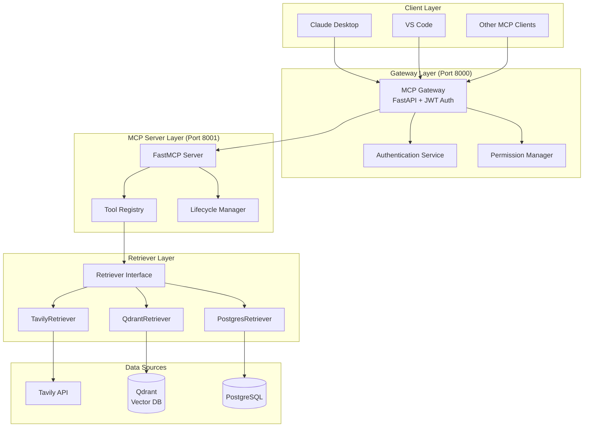

# MCP for Retriever - Implementation Design Document

## Project Overview

This document outlines the detailed implementation design for the MCP (Model Context Protocol) for Retriever project. The system integrates multiple data retrieval services (Web Search, Vector DB, RDB) through a unified FastMCP server with authentication and authorization capabilities.

## Architecture Components

### 1. System Architecture



### 2. Key Design Decisions

#### 2.1 Common Retriever Interface

**Decision**: Use an Abstract Base Class (ABC) pattern for all retrievers.

**Rationale**:
- Ensures consistent API across different data sources
- Enables easy addition of new retriever types
- Supports dependency injection and testing
- Leverages Python 3.12+ type features for better type safety

**Implementation**:
```python
class Retriever(ABC):
    @abstractmethod
    async def connect(self) -> None: ...
    
    @abstractmethod
    async def disconnect(self) -> None: ...
    
    @abstractmethod
    async def retrieve(self, query: str, limit: int = 10, **kwargs) -> AsyncIterator[QueryResult]: ...
    
    @abstractmethod
    async def health_check(self) -> RetrieverHealth: ...
```

#### 2.2 Authentication Strategy

**Decision**: Implement JWT-based authentication with asymmetric encryption.

**Rationale**:
- Separation of concerns between token issuance (Gateway) and validation (MCP Server)
- Scalable architecture - multiple MCP servers can validate tokens independently
- No shared secrets between components
- Industry-standard approach for service-to-service authentication

**Flow**:
1. Client authenticates with Gateway using credentials
2. Gateway issues JWT signed with private key
3. Client includes JWT in requests to MCP Server
4. MCP Server validates JWT using public key

#### 2.3 Permission Model

**Decision**: Implement tool-level permissions with scope-based access control.

**Rationale**:
- Fine-grained control over which tools users can access
- Flexible scope system for future expansion
- Easy to audit and manage permissions
- Compatible with OAuth 2.0 scope model

**Permission Scopes**:
- `mcp:read` - Basic read access (required)
- `web:search` - Access to web search tools
- `vector:search` - Access to vector database tools
- `vector:write` - Write access to vector database
- `db:read` - Read access to relational database
- `db:write` - Write access to relational database

## Development Approach

### 1. Test-Driven Development (TDD)

We follow a strict TDD approach with the following cycle:

1. **Red Phase**: Write failing tests that define expected behavior
2. **Green Phase**: Write minimal code to make tests pass
3. **Refactor Phase**: Improve code quality while maintaining green tests

Example workflow:
```python
# 1. Write failing test
async def test_retriever_connect():
    retriever = MockRetriever({})
    assert retriever.connected is False
    await retriever.connect()
    assert retriever.connected is True  # This will fail initially

# 2. Implement minimal code
class MockRetriever(Retriever):
    def __init__(self, config):
        super().__init__(config)
        self.connected = False
    
    async def connect(self):
        self.connected = True

# 3. Refactor and improve
```

### 2. Modern Python Practices

#### Type Safety with `ty`
- All code uses Python 3.12+ type annotations
- Type aliases for complex types: `type QueryResult = dict[str, Any]`
- Generic type parameters for reusable components
- Run `uv run ty src/` before every commit

#### Code Quality with `ruff`
- Consistent formatting: `uv run ruff format src/`
- Linting for common issues: `uv run ruff check src/`
- Pre-configured rules in `pyproject.toml`

#### Structured Logging
- Use `structlog` for all logging
- Include context (user_id, request_id) in all log entries
- Separate log levels for debugging vs production

### 3. Project Structure

```
make-mcp-server-vibe/
├── src/
│   ├── __init__.py
│   ├── server.py              # Main FastMCP server
│   ├── auth/
│   │   ├── __init__.py
│   │   ├── server.py          # FastAPI gateway server
│   │   ├── models.py          # Pydantic models
│   │   ├── jwt_handler.py    # JWT token management
│   │   └── permissions.py     # Permission checking
│   ├── retrievers/
│   │   ├── __init__.py
│   │   ├── base.py           # Abstract base class
│   │   ├── tavily.py         # Web search implementation
│   │   ├── qdrant.py         # Vector DB implementation
│   │   ├── postgres.py       # RDB implementation
│   │   └── factory.py        # Retriever factory
│   └── utils/
│       ├── __init__.py
│       ├── config.py         # Configuration management
│       └── logging.py        # Logging setup
├── tests/
│   ├── unit/
│   │   ├── test_retrievers/
│   │   ├── test_auth/
│   │   └── test_server/
│   ├── integration/
│   └── fixtures/
├── docs/
│   ├── implementation-design.md  # This document
│   ├── api-reference.md
│   └── deployment-guide.md
├── pyproject.toml
├── README.md
└── CLAUDE.md
```

## Implementation Phases

### Phase 1: Foundation (Current)
**Goal**: Establish project structure and core abstractions

**Tasks**:
1. ✅ Initialize project with `uv`
2. Create base Retriever interface
3. Write comprehensive unit tests
4. Implement mock retriever
5. Set up CI/CD pipeline

**Deliverables**:
- Working project structure
- Passing tests for base interface
- Mock implementation for testing

### Phase 2: Retriever Implementations
**Goal**: Implement concrete retrievers for each data source

**Tasks**:
1. Implement TavilyRetriever with connection pooling
2. Implement QdrantRetriever with batch operations
3. Implement PostgresRetriever with prepared statements
4. Add retry logic and circuit breakers
5. Integration tests for each retriever

**Deliverables**:
- Three working retriever implementations
- Integration tests with mock services
- Performance benchmarks

### Phase 3: MCP Server
**Goal**: Build FastMCP server with tools and lifecycle management

**Tasks**:
1. Create FastMCP server instance
2. Implement tool functions for each retriever
3. Add lifecycle management (startup/shutdown)
4. Implement health check endpoints
5. Add structured logging and metrics

**Deliverables**:
- Working MCP server
- Tools for search operations
- Health monitoring capabilities

### Phase 4: Authentication Gateway
**Goal**: Implement secure authentication and authorization

**Tasks**:
1. Create FastAPI gateway application
2. Implement JWT token generation/validation
3. Add user authentication endpoints
4. Implement permission checking
5. Create MCP request proxy

**Deliverables**:
- Secure authentication flow
- Permission-based access control
- Working gateway proxy

### Phase 5: Production Readiness
**Goal**: Prepare system for production deployment

**Tasks**:
1. Add comprehensive error handling
2. Implement rate limiting
3. Add monitoring and alerting
4. Create deployment configurations
5. Write user documentation

**Deliverables**:
- Production-ready system
- Deployment documentation
- Monitoring dashboards

## Security Considerations

### 1. Authentication
- JWT tokens with short expiration (1 hour)
- Refresh token mechanism for long sessions
- Asymmetric encryption (RS256) for token signing

### 2. Authorization
- Tool-level permission checking
- Scope-based access control
- User isolation for data access

### 3. Data Protection
- Environment variables for sensitive configuration
- No hardcoded secrets in code
- Encrypted connections to all data sources

### 4. Input Validation
- Pydantic models for all inputs
- SQL injection prevention
- Rate limiting per user

## Performance Considerations

### 1. Connection Management
- Connection pooling for all data sources
- Lazy loading of connections
- Graceful shutdown handling

### 2. Async Operations
- All I/O operations are async
- Concurrent retriever queries where possible
- Streaming results for large datasets

### 3. Caching Strategy
- In-memory caching for frequently accessed data
- Cache invalidation on updates
- Configurable TTL per cache type

## Monitoring and Observability

### 1. Logging
- Structured logging with `structlog`
- Correlation IDs for request tracing
- Different log levels for environments

### 2. Metrics
- Request latency histograms
- Error rate counters
- Resource utilization gauges

### 3. Health Checks
- Individual retriever health status
- Overall system health endpoint
- Dependency health monitoring

## Error Handling Strategy

### 1. Retriever Errors
- Graceful degradation when a retriever fails
- Circuit breaker pattern for failing services
- Detailed error messages for debugging

### 2. Authentication Errors
- Clear error messages for auth failures
- Audit logging for security events
- Rate limiting for failed attempts

### 3. User-Facing Errors
- Friendly error messages for users
- Error codes for programmatic handling
- Suggestions for error resolution

## Testing Strategy

### 1. Unit Tests
- Test each component in isolation
- Mock external dependencies
- Aim for >90% code coverage

### 2. Integration Tests
- Test retriever integrations
- Test authentication flow
- Test permission enforcement

### 3. End-to-End Tests
- Full workflow testing
- Performance testing
- Security testing

## Deployment Architecture

### 1. Container Strategy
- Separate containers for Gateway and MCP Server
- Shared network for internal communication
- Environment-specific configurations

### 2. Database Setup
- PostgreSQL for user data and permissions
- Qdrant for vector storage
- Redis for caching and rate limiting

### 3. Monitoring Stack
- Prometheus for metrics
- Grafana for visualization
- AlertManager for notifications

## Future Enhancements

### 1. Additional Retrievers
- Elasticsearch integration
- MongoDB support
- S3 file retrieval

### 2. Advanced Features
- Query result ranking
- Cross-retriever search
- Result aggregation

### 3. Enterprise Features
- SAML/OIDC support
- Audit logging
- Multi-tenancy

## Conclusion

This design provides a robust, scalable, and secure implementation of an MCP server for multiple retrieval services. The modular architecture allows for easy extension and maintenance, while the comprehensive testing and monitoring ensure production readiness.

The use of modern Python features and best practices ensures code quality and maintainability, while the focus on security and performance makes the system suitable for enterprise deployment.