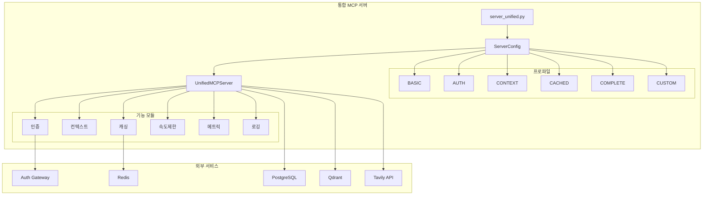
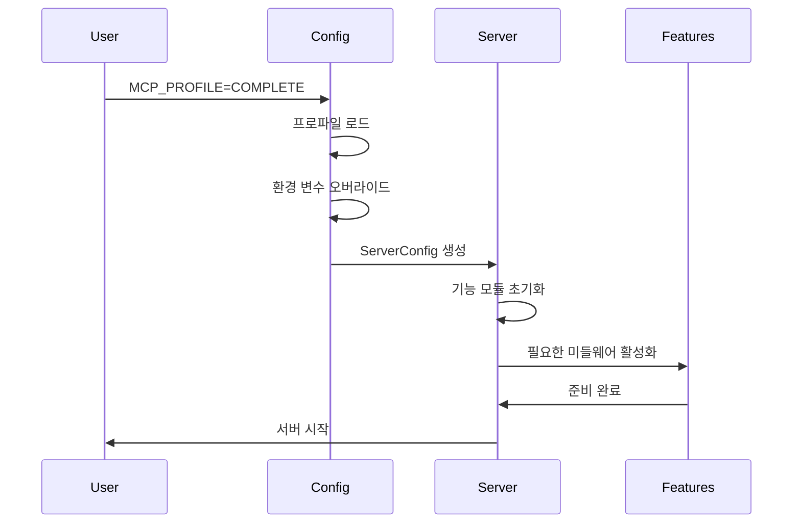

# 서버 구조 - 리팩토링 후

## 개요

모든 서버 파일이 하나의 통합 서버로 합쳐졌습니다.

## 파일 구조

```
src/
├── server_unified.py          # 통합 서버 (유일한 서버 파일)
├── config/                    # 설정 관리
│   ├── __init__.py
│   ├── settings.py           # 서버 설정 클래스
│   ├── validators.py         # 설정 검증
│   └── profiles/             # 환경별 프로파일
│       ├── __init__.py
│       ├── dev.py
│       ├── staging.py
│       └── prod.py
└── old/                      # 원본 파일 (참조용)
    ├── README.md
    ├── server_auth_original.py
    ├── server_context_original.py
    ├── server_with_cache_original.py
    └── server_complete_original.py
```

## 통합 서버 아키텍처



## 프로파일별 기능 매핑

| 프로파일 | 활성화된 기능 | 기존 서버 대체 |
|---------|-------------|--------------|
| BASIC | 최소 기능 | - |
| AUTH | 인증, 로깅, 유효성 검사 | server_auth.py |
| CONTEXT | 인증, 컨텍스트, 메트릭 | server_context.py |
| CACHED | 인증, 캐싱 | server_with_cache.py |
| COMPLETE | 모든 기능 | server_complete.py |
| CUSTOM | 사용자 정의 | - |

## 실행 흐름



## 주요 개선사항

1. **단일 진입점**: 하나의 서버 파일로 모든 기능 제어
2. **중복 제거**: 약 2,000줄의 중복 코드 제거
3. **설정 중앙화**: config/ 디렉토리에서 모든 설정 관리
4. **유연한 구성**: 프로파일과 환경 변수로 세밀한 제어
5. **확장성**: 새로운 기능 추가가 용이한 구조

## 마이그레이션 명령어

```bash
# 이전 (제거됨)
python -m src.server_auth
python -m src.server_context
python -m src.server_with_cache
python -m src.server_complete

# 현재 (통합 서버)
MCP_PROFILE=AUTH python -m src.server_unified
MCP_PROFILE=CONTEXT python -m src.server_unified
MCP_PROFILE=CACHED python -m src.server_unified
MCP_PROFILE=COMPLETE python -m src.server_unified
```