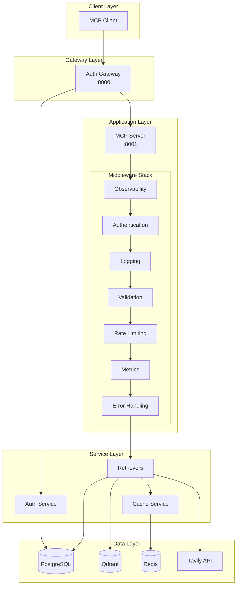
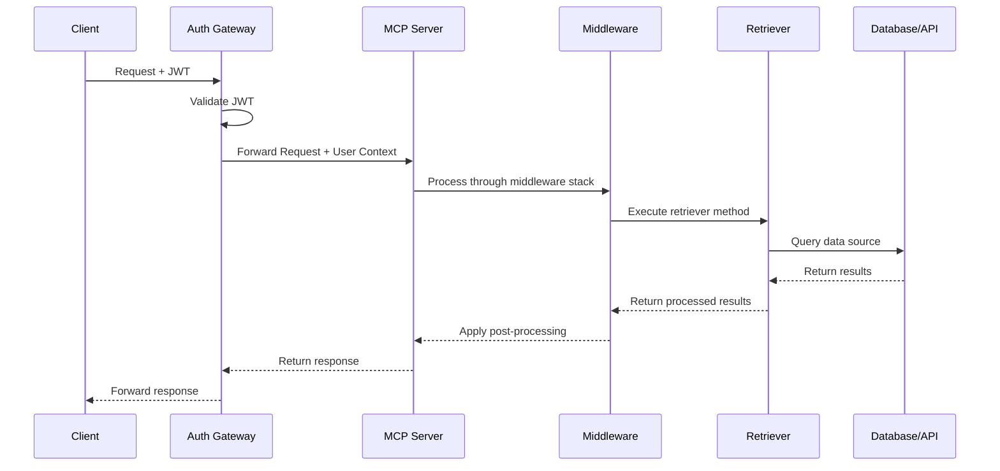

# MCP for Retriever 프로젝트 구조

이 문서는 MCP for Retriever 프로젝트의 전체 구조와 각 모듈의 역할을 설명합니다.

## 프로젝트 개요

MCP for Retriever는 다양한 데이터 소스(웹, 벡터 DB, RDB)에서 정보를 검색하고 통합하는 MCP(Model Context Protocol) 서버입니다.

## 전체 아키텍처



## 디렉토리 구조

```
make-mcp-server-vibe/
├── src/                      # 소스 코드
│   ├── auth/                # 인증/인가 시스템
│   ├── cache/              # 캐싱 시스템
│   ├── middleware/         # 미들웨어 스택
│   ├── observability/      # 관찰성 (OpenTelemetry, Sentry)
│   ├── retrievers/         # 리트리버 구현체
│   └── server*.py          # MCP 서버 구현
├── tests/                   # 테스트 코드
│   ├── unit/              # 단위 테스트
│   └── integration/       # 통합 테스트
├── docs/                   # 문서
│   ├── structure/         # 프로젝트 구조 문서
│   └── annotation-plan.md # 주석 계획
├── scripts/               # 유틸리티 스크립트
├── docker/               # Docker 관련 파일
└── reference_docs/       # 참고 문서
```

## 주요 모듈

### 1. [인증/인가 시스템 (auth)](./auth.md)
- JWT 기반 사용자 인증
- 역할 기반 접근 제어 (RBAC)
- MCP 요청 프록시

### 2. [리트리버 시스템 (retrievers)](./retrievers.md)
- 추상 리트리버 인터페이스
- Tavily 웹 검색 구현
- Qdrant 벡터 데이터베이스 구현
- PostgreSQL 데이터베이스 구현

### 3. [미들웨어 스택 (middleware)](./middleware.md)
- 인증 검증
- 요청/응답 로깅
- 요청 속도 제한
- 입력 검증
- 성능 메트릭 수집
- 에러 처리

### 4. [관찰성 시스템 (observability)](./observability.md)
- OpenTelemetry 분산 추적
- Sentry 에러 추적
- Prometheus 메트릭

### 5. [캐싱 시스템 (cache)](./cache.md)
- Redis 기반 캐싱
- TTL 관리
- 캐시 무효화 전략

### 6. [MCP 서버](./server.md)
- FastMCP 기반 구현
- 도구 엔드포인트
- 컨텍스트 관리

## 데이터 흐름



## 개발 가이드

각 모듈의 상세한 구조와 개발 가이드는 다음 문서를 참조하세요:

1. [src 폴더 구조](./src.md) - 전체 소스 코드 구조
2. [auth 모듈 가이드](./auth.md) - 인증 시스템 개발
3. [retrievers 모듈 가이드](./retrievers.md) - 새로운 리트리버 추가
4. [middleware 모듈 가이드](./middleware.md) - 미들웨어 개발
5. [observability 모듈 가이드](./observability.md) - 모니터링 설정
6. [cache 모듈 가이드](./cache.md) - 캐싱 전략
7. [tests 구조](./tests.md) - 테스트 작성 가이드

## 주요 디자인 패턴

### 1. 추상 팩토리 패턴
리트리버 생성을 위한 팩토리 패턴 사용

### 2. 미들웨어 패턴
요청 처리를 위한 체인 오브 책임 패턴

### 3. 의존성 주입
느슨한 결합을 위한 DI 패턴

### 4. 비동기 패턴
Python asyncio를 활용한 비동기 처리

## 기술 스택

- **언어**: Python 3.12+
- **프레임워크**: FastAPI, FastMCP
- **데이터베이스**: PostgreSQL, Qdrant, Redis
- **인증**: JWT
- **모니터링**: OpenTelemetry, Sentry
- **컨테이너**: Docker, Docker Compose
- **테스트**: pytest, pytest-asyncio