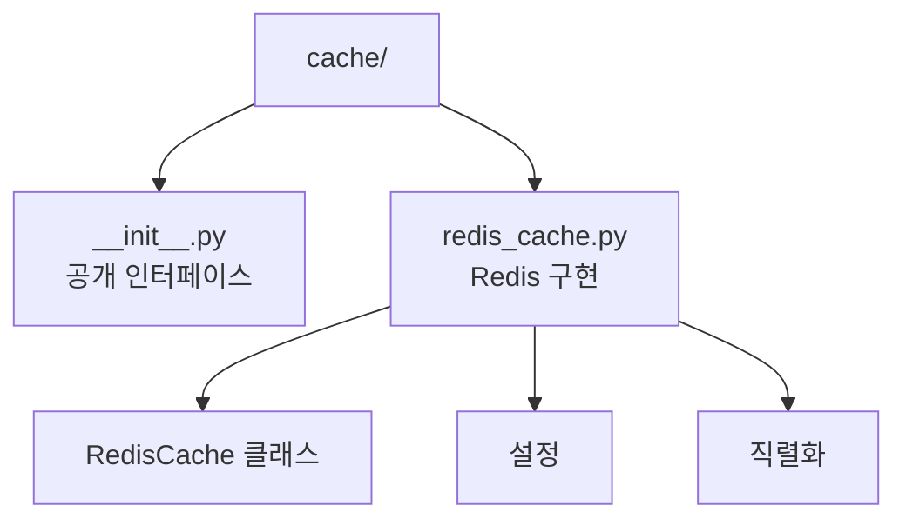
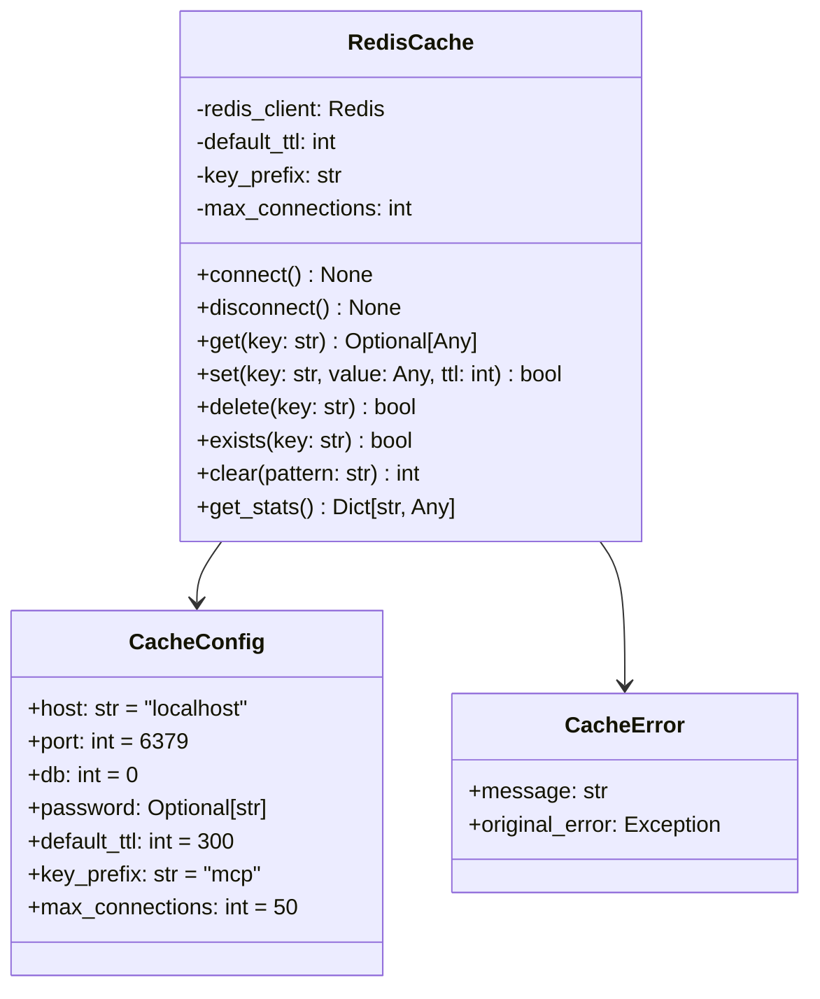
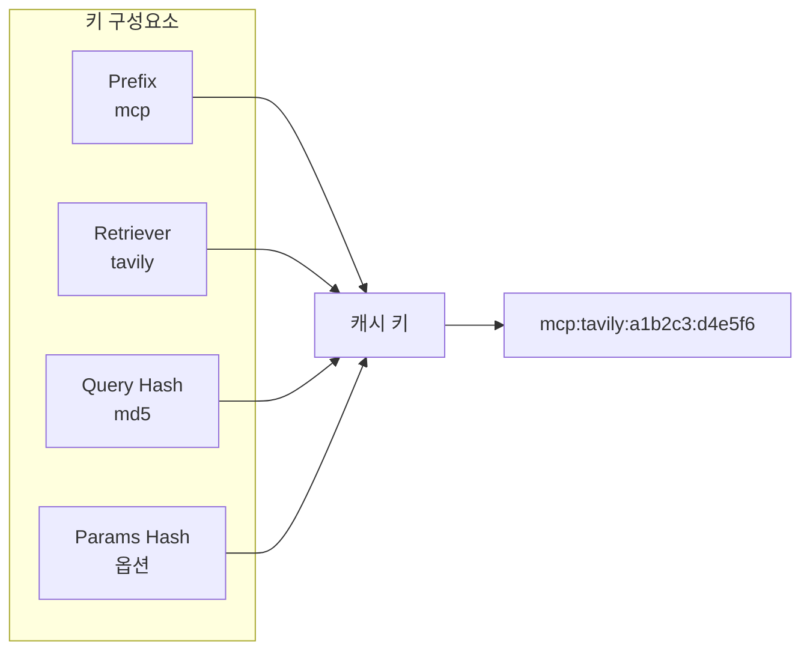
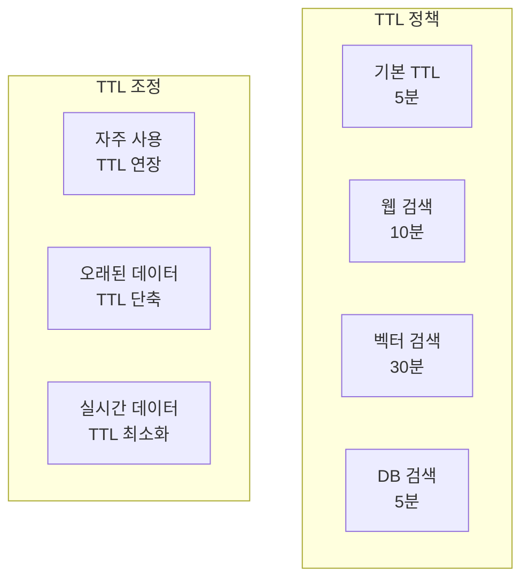
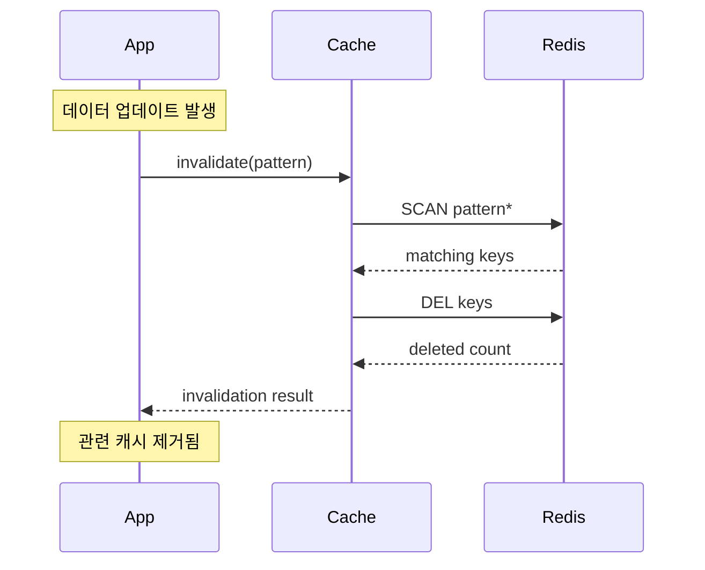
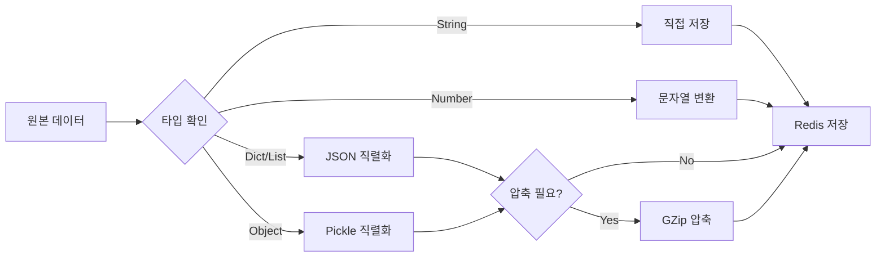
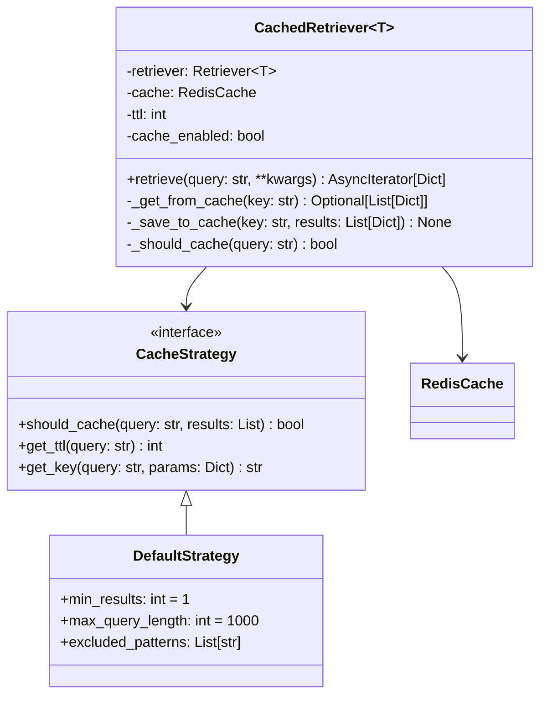
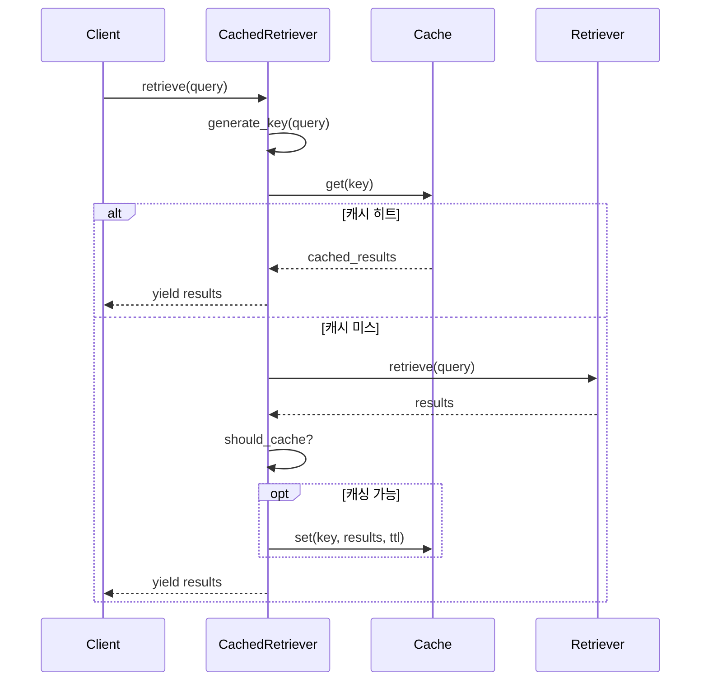
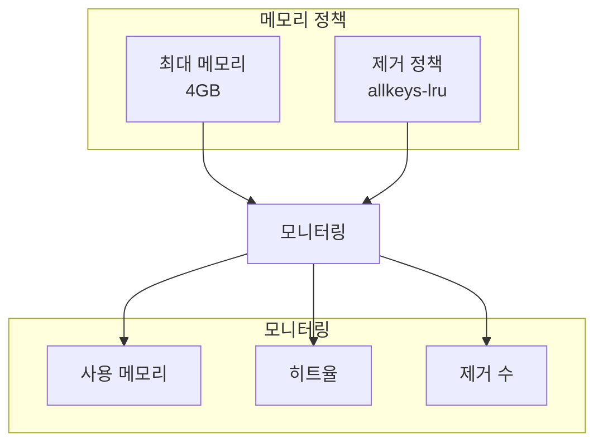
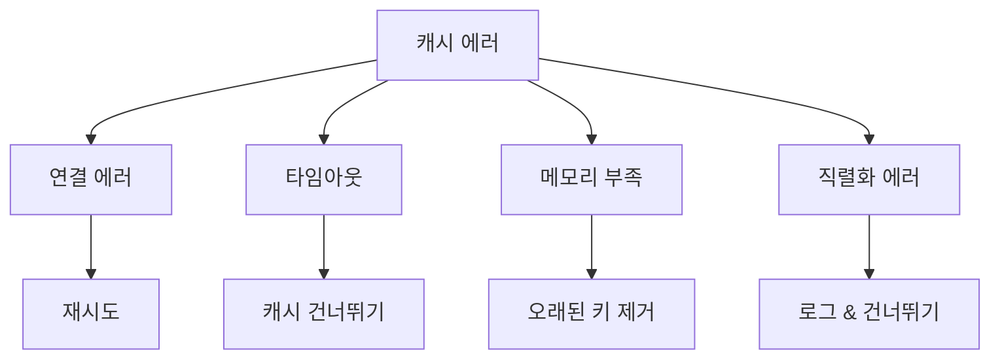

# Cache 모듈 구조

캐싱 시스템은 Redis를 사용하여 리트리버 결과를 캐싱하고 성능을 최적화합니다.

## 모듈 구조



## 주요 컴포넌트

### RedisCache 클래스



## 캐싱 전략

### 1. 캐시 키 생성



키 생성 알고리즘:
```python
def generate_cache_key(
    retriever_type: str,
    query: str,
    params: Dict[str, Any]
) -> str:
    # 쿼리 해시
    query_hash = hashlib.md5(query.encode()).hexdigest()[:8]
    
    # 파라미터 정렬 및 해시
    sorted_params = json.dumps(params, sort_keys=True)
    params_hash = hashlib.md5(sorted_params.encode()).hexdigest()[:8]
    
    return f"{prefix}:{retriever_type}:{query_hash}:{params_hash}"
```

### 2. TTL 관리



### 3. 캐시 무효화



## 직렬화 전략

### 지원하는 데이터 타입

```python
SERIALIZABLE_TYPES = {
    dict: json.dumps,
    list: json.dumps,
    str: str,
    int: str,
    float: str,
    bool: lambda x: "1" if x else "0",
    datetime: lambda x: x.isoformat()
}
```

### 직렬화 프로세스



## CachedRetriever 통합



### 캐싱 플로우



## 성능 최적화

### 1. 연결 풀링

```python
# Redis 연결 풀 설정
connection_pool = redis.ConnectionPool(
    host=config.host,
    port=config.port,
    db=config.db,
    password=config.password,
    max_connections=config.max_connections,
    socket_keepalive=True,
    socket_keepalive_options={
        1: 1,  # TCP_KEEPIDLE
        2: 1,  # TCP_KEEPINTVL
        3: 3,  # TCP_KEEPCNT
    }
)
```

### 2. 파이프라이닝

```python
# 여러 작업을 파이프라인으로 처리
async def batch_get(keys: List[str]) -> List[Optional[Any]]:
    pipe = redis_client.pipeline()
    for key in keys:
        pipe.get(key)
    results = await pipe.execute()
    return [deserialize(r) if r else None for r in results]
```

### 3. 메모리 관리



## 캐시 통계

### 수집 메트릭

```python
class CacheStats:
    hits: int = 0          # 캐시 히트 수
    misses: int = 0        # 캐시 미스 수
    sets: int = 0          # 저장 작업 수
    deletes: int = 0       # 삭제 작업 수
    errors: int = 0        # 에러 수
    
    @property
    def hit_rate(self) -> float:
        total = self.hits + self.misses
        return self.hits / total if total > 0 else 0.0
```

### 통계 리포트

```json
{
    "cache_stats": {
        "hit_rate": 0.85,
        "total_hits": 12500,
        "total_misses": 2200,
        "total_sets": 2180,
        "total_deletes": 150,
        "total_errors": 5,
        "avg_get_time_ms": 1.2,
        "avg_set_time_ms": 2.5,
        "memory_usage_mb": 125.4,
        "key_count": 3450
    }
}
```

## 에러 처리

### 에러 유형



### 에러 복구 전략

```python
async def get_with_fallback(key: str) -> Optional[Any]:
    try:
        # 캐시 조회 시도
        return await cache.get(key)
    except redis.ConnectionError:
        # 연결 에러 시 재연결 시도
        await cache.reconnect()
        return None
    except redis.TimeoutError:
        # 타임아웃 시 None 반환
        logger.warning(f"Cache timeout for key: {key}")
        return None
    except Exception as e:
        # 기타 에러는 로그만
        logger.error(f"Cache error: {e}")
        return None
```

## 환경 변수 설정

```bash
# Redis 연결
REDIS_HOST=localhost
REDIS_PORT=6379
REDIS_DB=0
REDIS_PASSWORD=your-password

# 캐시 설정
CACHE_DEFAULT_TTL=300
CACHE_KEY_PREFIX=mcp
CACHE_MAX_CONNECTIONS=50
CACHE_SOCKET_TIMEOUT=5
CACHE_RETRY_ON_TIMEOUT=true

# 성능 튜닝
CACHE_COMPRESSION_THRESHOLD=1024  # bytes
CACHE_ENABLE_PIPELINE=true
CACHE_PIPELINE_SIZE=100
```

## 모범 사례

### 1. 캐시 키 설계
- 의미 있는 네임스페이스 사용
- 버전 정보 포함
- 쿼리 파라미터 정규화

### 2. TTL 설정
- 데이터 특성에 따른 적절한 TTL
- 비즈니스 요구사항 고려
- 캐시 스탬피드 방지

### 3. 모니터링
- 히트율 추적
- 응답 시간 모니터링
- 메모리 사용량 관찰

### 4. 에러 처리
- 캐시 장애 시 서비스 지속
- 적절한 폴백 메커니즘
- 에러 로깅 및 알림