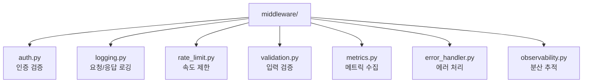
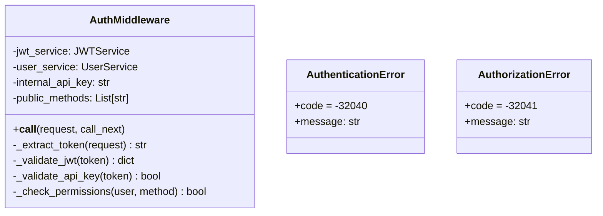
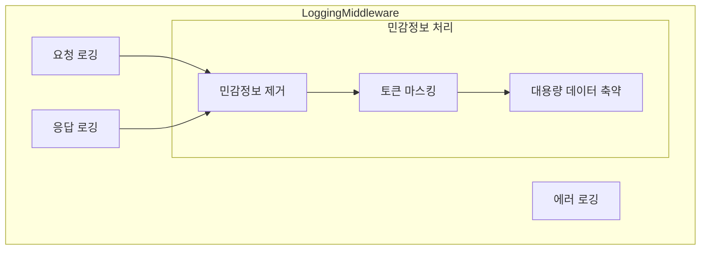
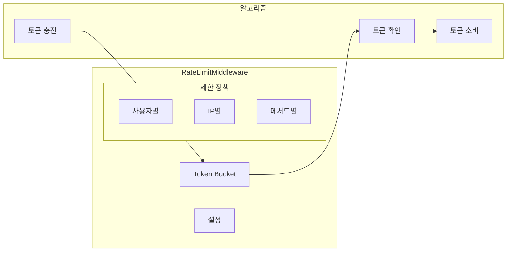
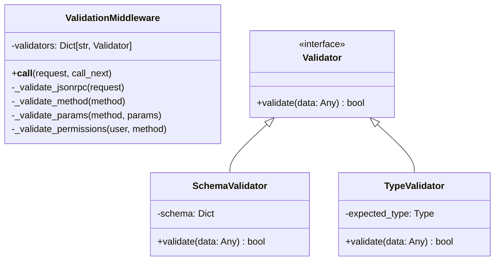
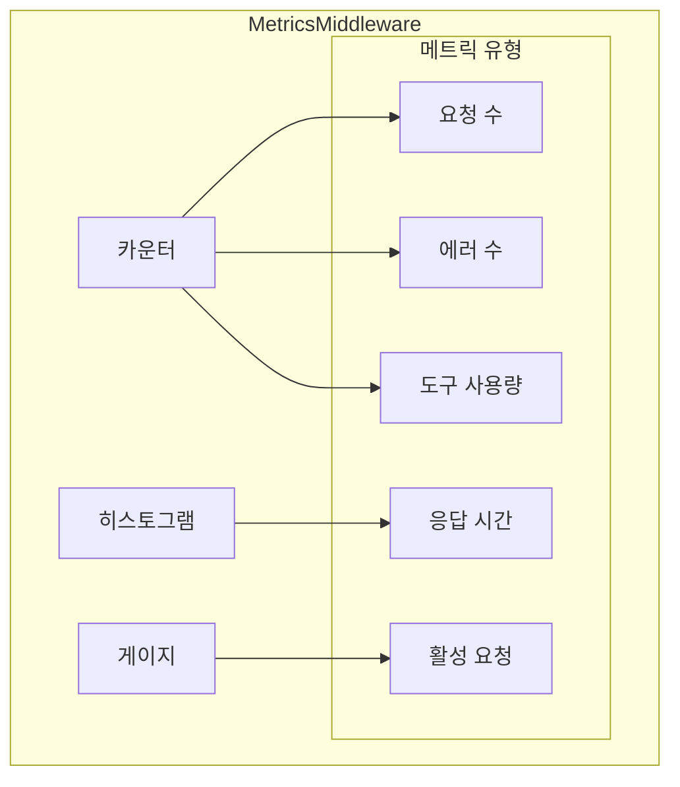
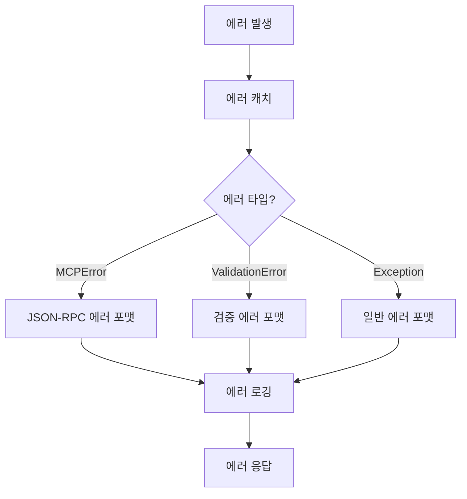
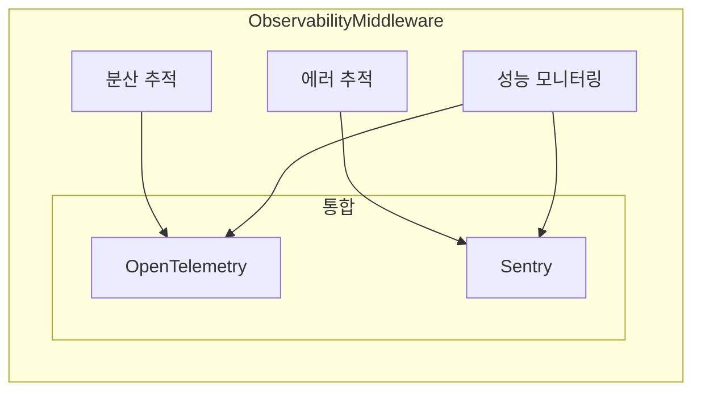

# Middleware 모듈 구조

미들웨어 스택은 모든 MCP 요청을 처리하는 파이프라인을 구성합니다.

## 모듈 구조



## 미들웨어 실행 순서


## 각 미들웨어 상세

### 1. auth.py - 인증 미들웨어



**주요 기능:**
- Bearer 토큰 추출
- JWT 토큰 검증
- 내부 API 키 검증
- 사용자 컨텍스트 주입
- 메서드별 권한 확인

### 2. logging.py - 로깅 미들웨어



**주요 기능:**
- 구조화된 로깅 (structlog)
- 민감정보 자동 제거
- 요청/응답 시간 측정
- 대용량 페이로드 축약
- 요청 ID 추적

### 3. rate_limit.py - 속도 제한 미들웨어



**Token Bucket 알고리즘:**
```python
class TokenBucket:
    capacity: int = 60      # 버킷 크기
    refill_rate: float = 1.0  # 초당 충전율
    burst_size: int = 10    # 버스트 허용량
```

**주요 기능:**
- 사용자별 속도 제한
- 버스트 트래픽 허용
- 분/시간 단위 제한
- 우아한 제한 (Graceful degradation)

### 4. validation.py - 검증 미들웨어



**검증 단계:**
1. JSON-RPC 형식 검증
2. 메서드 존재 여부 확인
3. 매개변수 타입 검증
4. 필수 매개변수 확인
5. 권한 검증 (RBAC)

### 5. metrics.py - 메트릭 미들웨어



**수집 메트릭:**
- 총 요청 수 (메서드별, 사용자별)
- 응답 시간 분포 (P50, P95, P99)
- 에러율 (타입별)
- 동시 요청 수
- 도구별 사용 통계

### 6. error_handler.py - 에러 처리 미들웨어



**에러 처리 전략:**
```python
ERROR_MAPPINGS = {
    AuthenticationError: -32040,
    AuthorizationError: -32041,
    ValidationError: -32602,
    RateLimitError: -32045,
    RetrieverError: -32603
}
```

### 7. observability.py - 관찰성 미들웨어



**주요 기능:**
- 분산 추적 컨텍스트 전파
- 자동 스팬 생성
- 에러 자동 캡처
- 성능 트랜잭션 추적
- Baggage를 통한 메타데이터 전파

## 미들웨어 설정

```python
class MiddlewareConfig:
    # 인증
    jwt_secret: str
    internal_api_key: str
    public_methods: List[str] = ["tools/list"]
    
    # 로깅
    log_level: str = "INFO"
    sanitize_keys: List[str] = ["password", "token", "api_key"]
    max_payload_size: int = 10000
    
    # 속도 제한
    rate_limit_per_minute: int = 60
    rate_limit_per_hour: int = 1000
    burst_size: int = 10
    
    # 메트릭
    enable_metrics: bool = True
    metrics_prefix: str = "mcp"
    
    # 관찰성
    enable_tracing: bool = True
    enable_sentry: bool = True
    trace_all_requests: bool = False
```

## 미들웨어 통합

```python
# server.py에서 미들웨어 스택 구성
def create_middleware_stack(handler):
    # 역순으로 래핑 (가장 바깥쪽부터)
    handler = ErrorHandlingMiddleware()(handler)
    handler = MetricsMiddleware()(handler)
    handler = RateLimitMiddleware(config)(handler)
    handler = ValidationMiddleware()(handler)
    handler = LoggingMiddleware()(handler)
    handler = AuthMiddleware(jwt_service, user_service)(handler)
    handler = ObservabilityMiddleware()(handler)
    return handler
```

## 커스텀 미들웨어 작성

### 미들웨어 인터페이스

```python
from typing import Callable, Dict, Any

class CustomMiddleware:
    """커스텀 미들웨어 템플릿"""
    
    def __init__(self, config: Any):
        self.config = config
        
    async def __call__(
        self, 
        request: Dict[str, Any], 
        call_next: Callable
    ) -> Dict[str, Any]:
        # 요청 전처리
        request = self.pre_process(request)
        
        try:
            # 다음 미들웨어 호출
            response = await call_next(request)
            
            # 응답 후처리
            response = self.post_process(response)
            
            return response
            
        except Exception as e:
            # 에러 처리
            return self.handle_error(e)
```

## 성능 고려사항

### 1. 비동기 처리
- 모든 미들웨어는 비동기로 구현
- I/O 작업 시 await 사용

### 2. 컨텍스트 전파
- 요청 객체를 통한 컨텍스트 전달
- 불필요한 복사 최소화

### 3. 조기 종료
- 인증 실패 시 즉시 반환
- 불필요한 미들웨어 실행 방지

### 4. 캐싱
- 권한 확인 결과 캐싱
- JWT 디코딩 결과 캐싱

## 모니터링 및 디버깅

### 로그 상관관계
```
request_id=abc123 method=tools/call user_id=user456 duration_ms=150
```

### 추적 정보
```
trace_id=0123456789abcdef span_id=fedcba9876543210
```

### 메트릭 대시보드
- Grafana를 통한 시각화
- Prometheus 메트릭 수집
- 실시간 에러율 모니터링