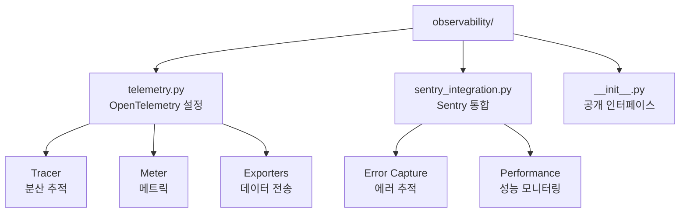
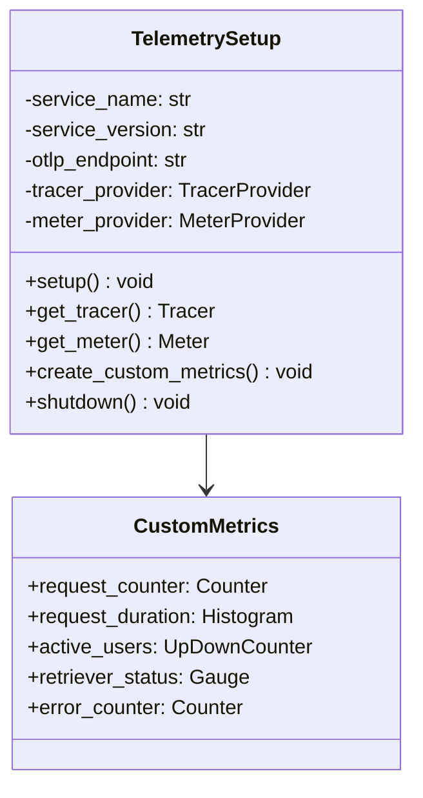
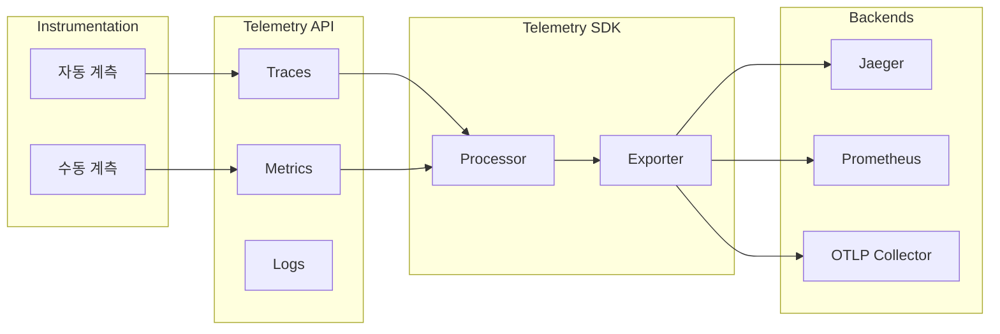
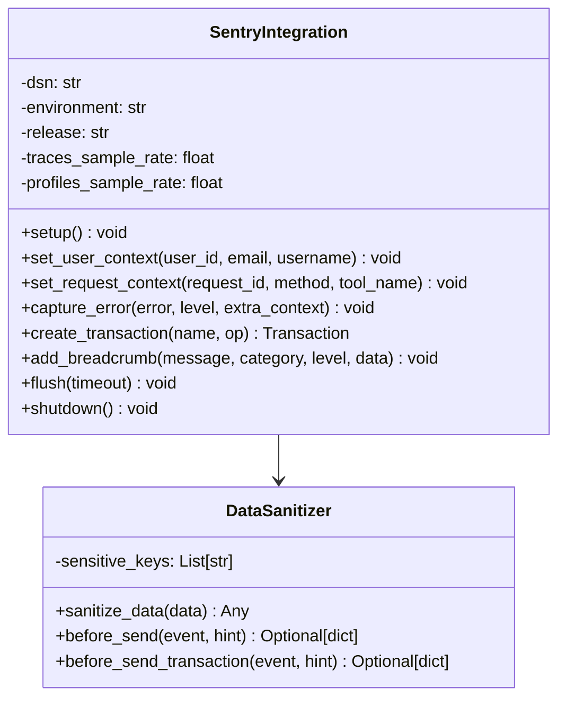
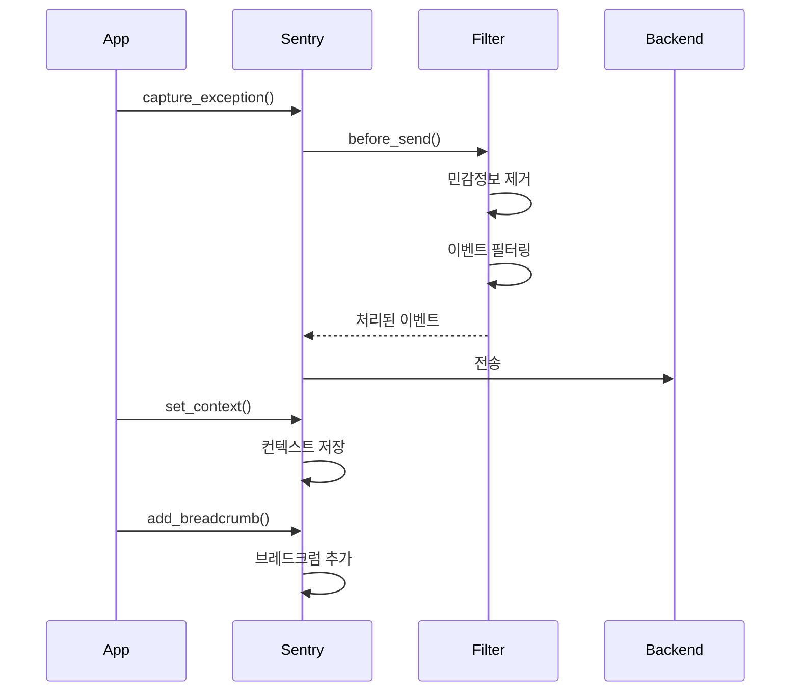
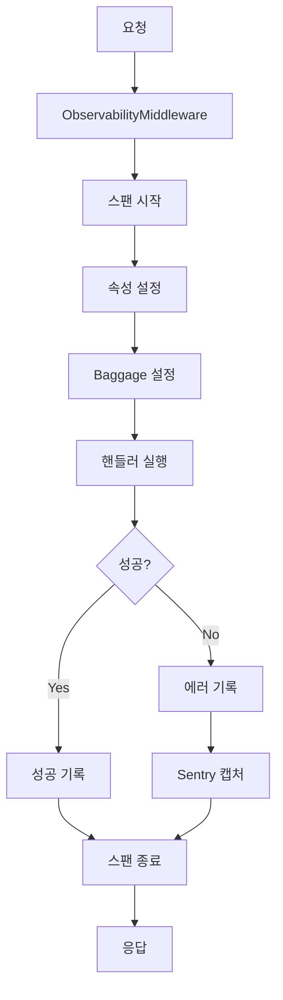
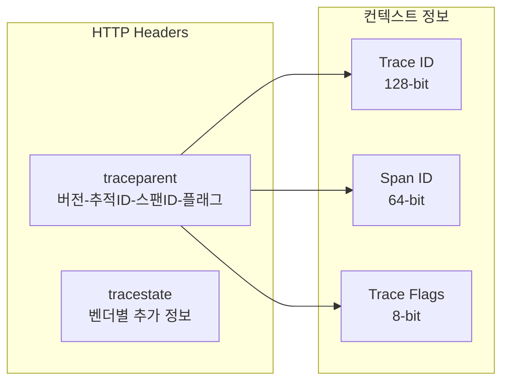
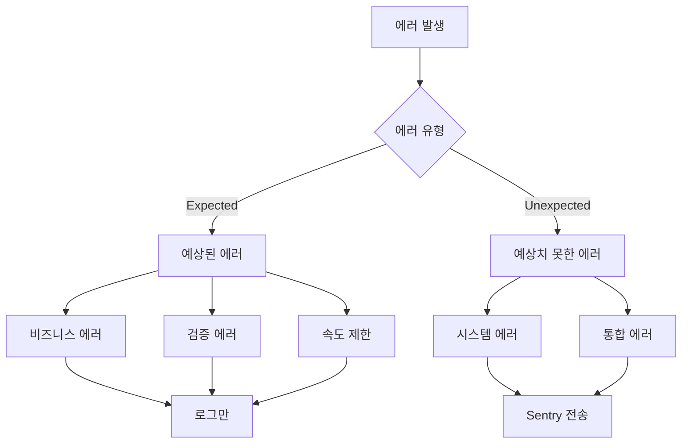
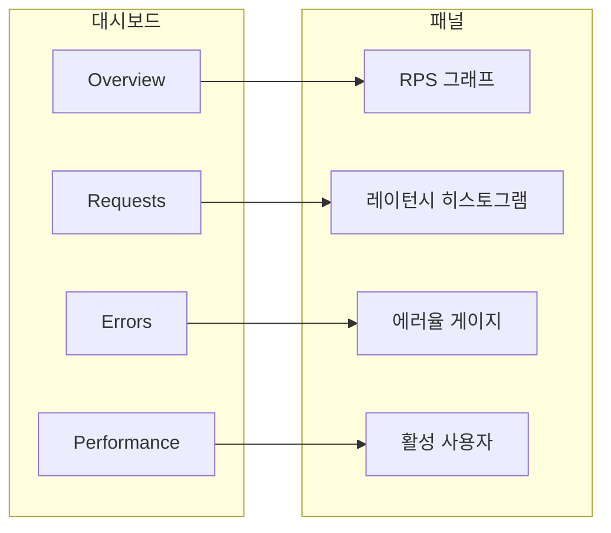

# Observability 모듈 구조

관찰성 모듈은 분산 추적, 메트릭 수집, 에러 추적을 통해 시스템의 상태를 모니터링합니다.

## 모듈 구조



## 주요 컴포넌트

### 1. telemetry.py - OpenTelemetry 설정



#### OpenTelemetry 아키텍처



#### 자동 계측 라이브러리

```python
# 자동으로 계측되는 라이브러리
INSTRUMENTED_LIBRARIES = {
    "FastAPI": FastAPIInstrumentor,
    "HTTPX": HTTPXClientInstrumentor,
    "AsyncPG": AsyncPGInstrumentor,
    "Redis": RedisInstrumentor
}
```

#### 커스텀 메트릭

```python
# MCP 작업을 위한 커스텀 메트릭
CUSTOM_METRICS = {
    "mcp.requests.total": Counter,      # 총 요청 수
    "mcp.request.duration": Histogram,   # 요청 처리 시간
    "mcp.users.active": UpDownCounter,   # 활성 사용자 수
    "mcp.retriever.status": Gauge,       # 리트리버 상태
    "mcp.errors.total": Counter          # 에러 수
}
```

### 2. sentry_integration.py - Sentry 통합



#### Sentry 데이터 흐름



#### 민감정보 처리

```python
SENSITIVE_PATTERNS = {
    "headers": ["authorization", "cookie", "x-api-key"],
    "data": ["password", "token", "api_key", "secret"],
    "user": ["email", "phone", "ssn"]
}
```

### 3. 통합 미들웨어



## 추적 컨텍스트 전파

### W3C Trace Context



### Baggage 전파

```python
# 사용자 정보를 Baggage로 전파
baggage.set_baggage("user.id", user_id)
baggage.set_baggage("user.type", user_type)
baggage.set_baggage("tenant.id", tenant_id)
```

## 메트릭 수집

### Prometheus 메트릭 형식

```promql
# 카운터
mcp_requests_total{method="tools/call", tool="search_web", status="success"} 1234

# 히스토그램
mcp_request_duration_seconds_bucket{le="0.1"} 456
mcp_request_duration_seconds_bucket{le="0.5"} 789
mcp_request_duration_seconds_sum 123.45
mcp_request_duration_seconds_count 1000

# 게이지
mcp_retriever_status{retriever="tavily", status="connected"} 1
mcp_active_users 42
```

### 메트릭 엔드포인트

```python
@app.get("/metrics")
async def metrics():
    """Prometheus 메트릭 엔드포인트"""
    return Response(
        generate_latest(),
        media_type="text/plain; version=0.0.4"
    )
```

## 에러 추적

### 에러 분류



### 에러 컨텍스트

```python
# 에러와 함께 캡처되는 컨텍스트
ERROR_CONTEXT = {
    "user": {
        "id": "user-123",
        "email": "user@example.com",
        "role": "user"
    },
    "request": {
        "id": "req-456",
        "method": "tools/call",
        "tool": "search_web"
    },
    "system": {
        "version": "1.0.0",
        "environment": "production",
        "host": "mcp-server-01"
    }
}
```

## 성능 모니터링

### 트랜잭션 추적

```python
# Sentry 성능 트랜잭션
with sentry_sdk.start_transaction(
    op="mcp.request",
    name="tools/call:search_web"
) as transaction:
    with transaction.start_child(
        op="retriever.search",
        description="Tavily search"
    ) as span:
        # 검색 실행
        results = await retriever.retrieve(query)
```

### 성능 메트릭

- **응답 시간**: P50, P75, P95, P99
- **처리량**: 초당 요청 수 (RPS)
- **에러율**: 실패한 요청 비율
- **포화도**: CPU, 메모리 사용률

## 대시보드 및 알림

### Grafana 대시보드



### 알림 규칙

```yaml
alerts:
  - name: HighErrorRate
    condition: rate(mcp_errors_total[5m]) > 0.05
    severity: warning
    
  - name: HighLatency
    condition: histogram_quantile(0.95, mcp_request_duration_seconds) > 1
    severity: warning
    
  - name: RetrieverDown
    condition: mcp_retriever_status == 0
    severity: critical
```

## 환경 변수 설정

```bash
# OpenTelemetry
OTEL_SERVICE_NAME=mcp-retriever
OTEL_SERVICE_VERSION=1.0.0
OTEL_EXPORTER_OTLP_ENDPOINT=http://localhost:4317
OTEL_EXPORTER_OTLP_HEADERS=api-key=your-key
OTEL_SDK_DISABLED=false

# Sentry
SENTRY_DSN=https://xxx@xxx.ingest.sentry.io/xxx
SENTRY_ENVIRONMENT=production
SENTRY_RELEASE=1.0.0
SENTRY_TRACES_SAMPLE_RATE=0.1
SENTRY_PROFILES_SAMPLE_RATE=0.1

# 메트릭
PROMETHEUS_PORT=9090
METRICS_PREFIX=mcp
```

## 문제 해결

### 추적이 표시되지 않을 때

1. OTLP 엔드포인트 연결 확인
2. 샘플링 비율 확인
3. 서비스 이름 설정 확인

### 메트릭이 수집되지 않을 때

1. Prometheus 스크레이프 설정 확인
2. 메트릭 엔드포인트 접근성 확인
3. 메트릭 이름 규칙 확인

### Sentry 이벤트가 전송되지 않을 때

1. DSN 설정 확인
2. 네트워크 연결 확인
3. before_send 필터 확인