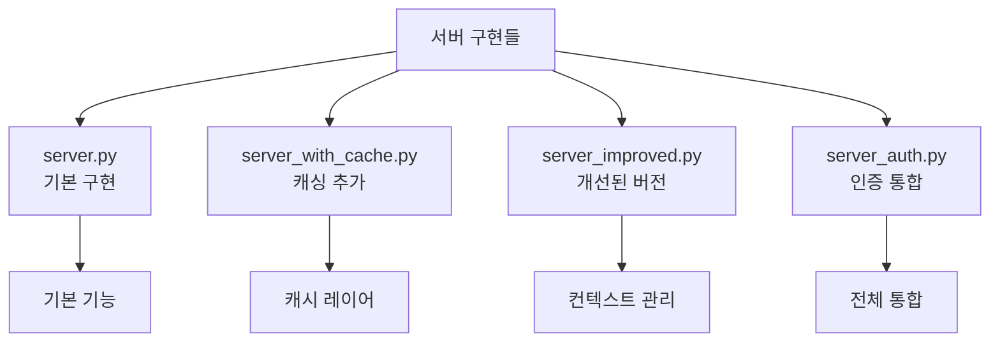
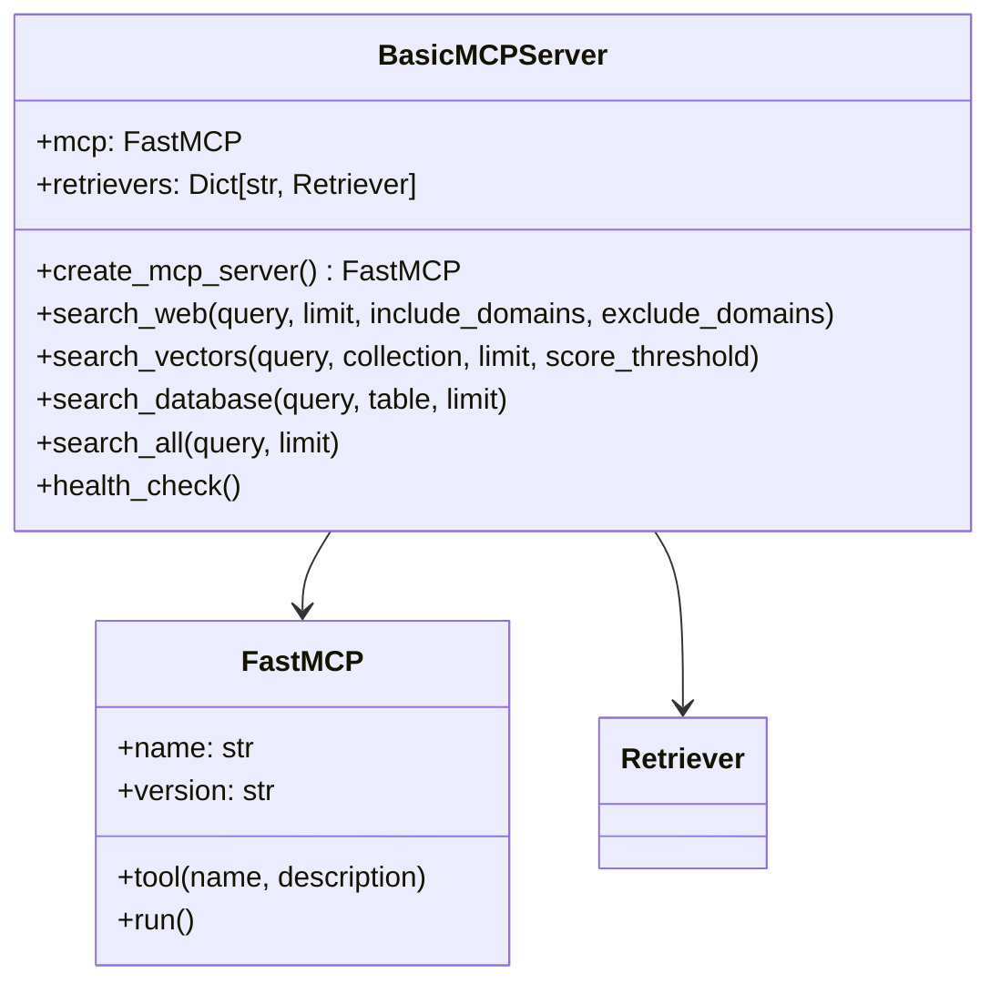
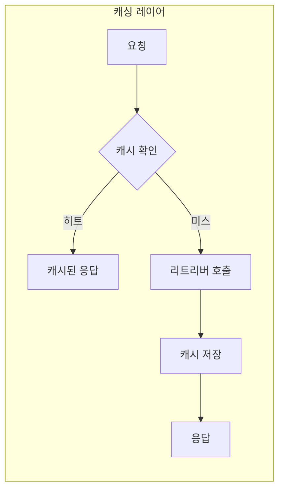
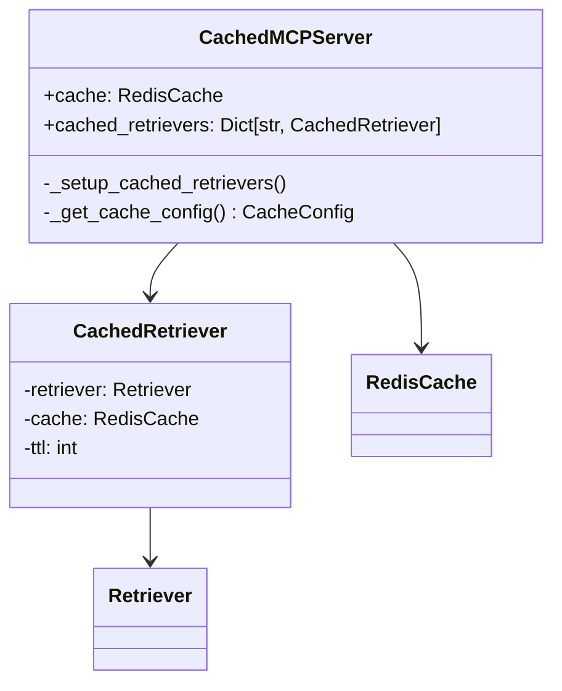
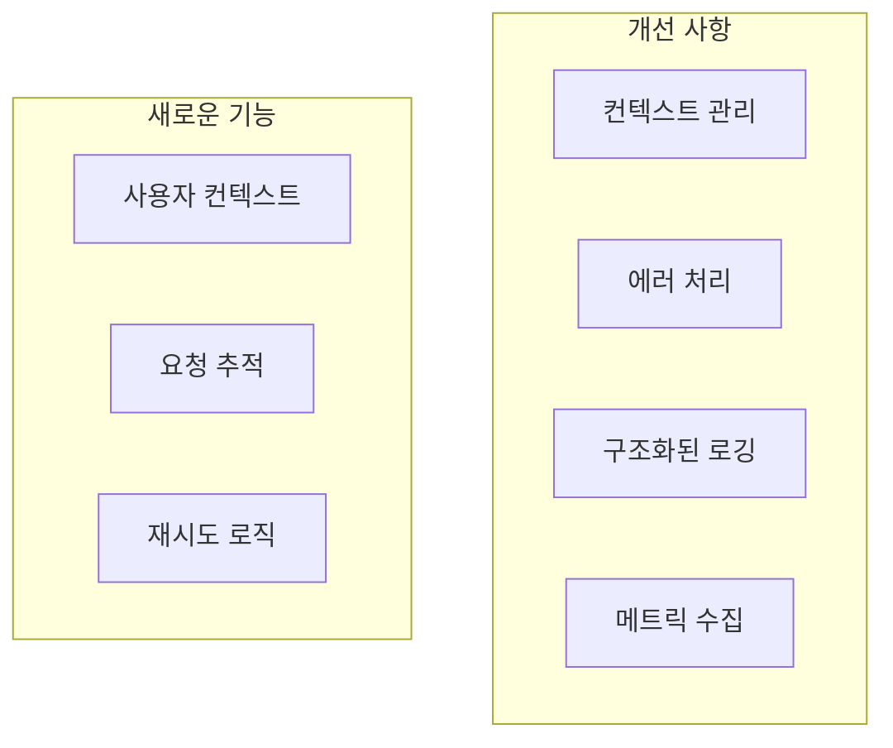
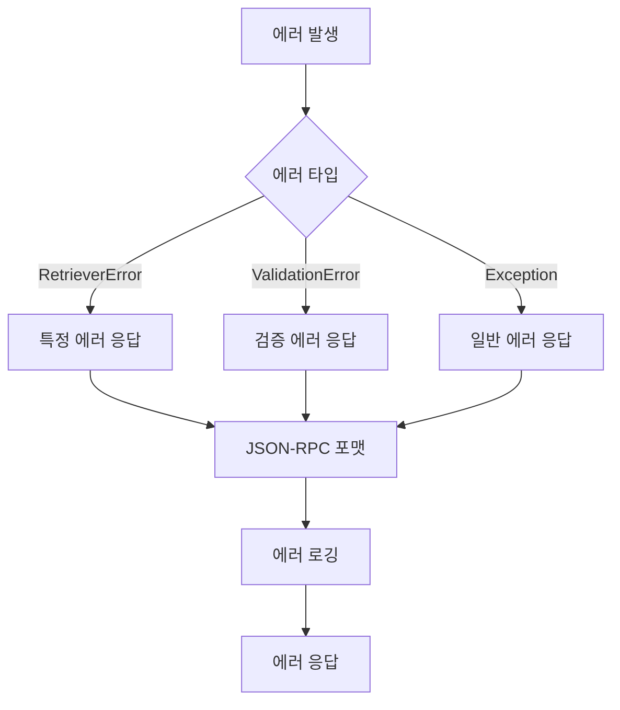
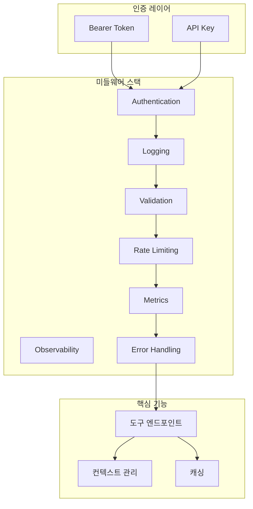
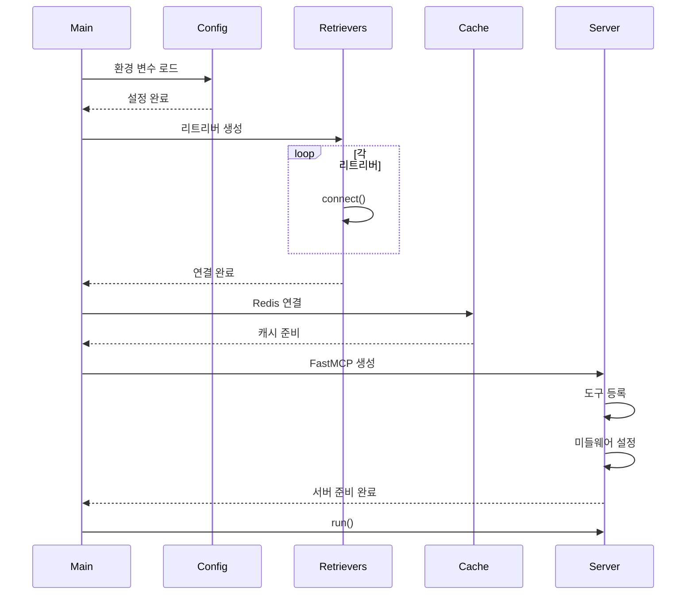
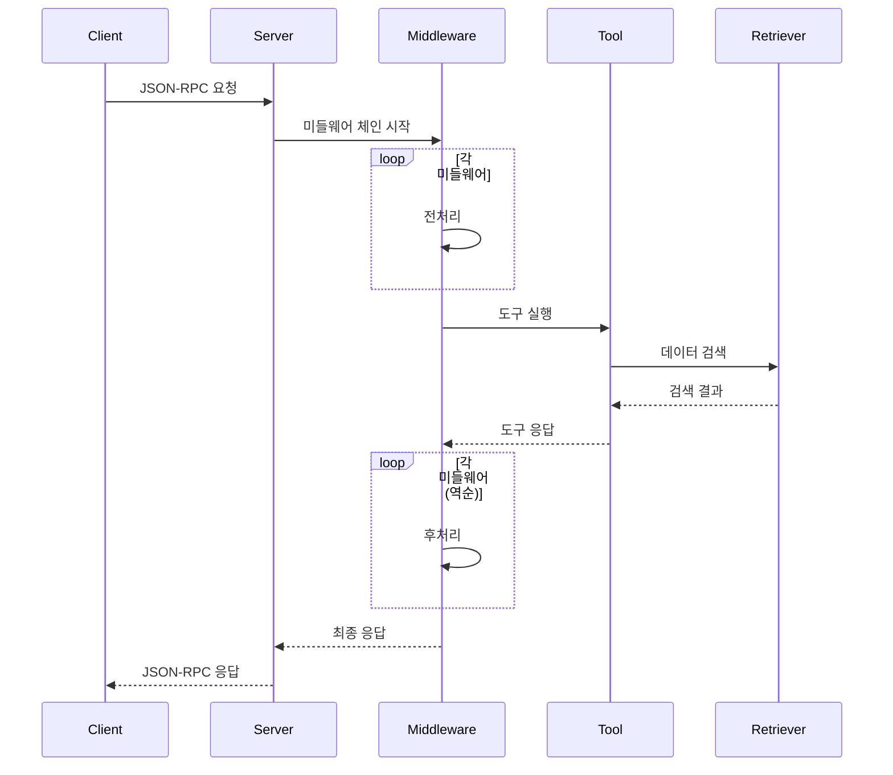
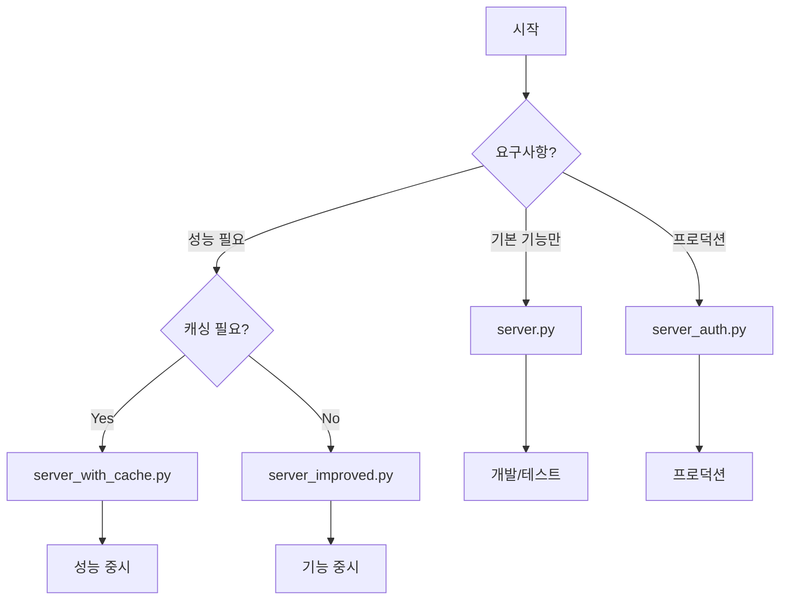

# Server 파일 구조

MCP 서버 구현은 점진적으로 기능이 추가된 여러 버전으로 구성되어 있습니다.

## 서버 파일 개요



## 1. server.py - 기본 MCP 서버

### 구조



### 주요 기능

- FastMCP 서버 초기화
- 기본 도구 엔드포인트 정의
- 리트리버 직접 연결
- 동기/비동기 변환 처리

### 도구 정의

```python
@mcp.tool(
    name="search_web",
    description="웹에서 정보 검색"
)
async def search_web(
    query: str,
    limit: int = 10,
    include_domains: list[str] = [],
    exclude_domains: list[str] = []
) -> list[dict[str, Any]]:
    """Tavily를 사용한 웹 검색"""
```

## 2. server_with_cache.py - 캐싱이 추가된 서버

### 구조



### 추가된 기능



### 캐시 설정

- Redis 연결 초기화
- 리트리버별 TTL 설정
- 캐시 키 생성 전략

## 3. server_improved.py - 개선된 서버

### 구조



### 컨텍스트 관리

```python
class Context:
    """요청 컨텍스트"""
    request_id: str
    user_id: Optional[str]
    method: str
    timestamp: datetime
    metadata: Dict[str, Any]
```

### 에러 처리 개선



## 4. server_auth.py - 인증이 통합된 서버

### 전체 아키텍처



### FastMCP 인증 통합

```python
# FastMCP Bearer 토큰 인증
mcp = FastMCP(
    name="mcp-retriever",
    auth=BearerTokenAuth(
        get_token=lambda: os.getenv("MCP_INTERNAL_API_KEY")
    )
)
```

### 미들웨어 통합

```python
def create_app():
    # 미들웨어 스택 구성
    app = FastAPI()
    
    # 미들웨어 추가 (실행 순서의 역순)
    app.add_middleware(ObservabilityMiddleware)
    app.add_middleware(AuthMiddleware)
    app.add_middleware(LoggingMiddleware)
    app.add_middleware(ValidationMiddleware)
    app.add_middleware(RateLimitMiddleware)
    app.add_middleware(MetricsMiddleware)
    app.add_middleware(ErrorHandlingMiddleware)
    
    return app
```

## 서버 실행 플로우

### 1. 초기화 단계



### 2. 요청 처리 플로우



## 설정 및 환경 변수

### 공통 설정

```bash
# MCP 서버
MCP_SERVER_NAME=mcp-retriever
MCP_SERVER_VERSION=1.0.0
MCP_TRANSPORT=stdio  # stdio | http

# 리트리버
TAVILY_API_KEY=your-key
POSTGRES_DSN=postgresql://...
QDRANT_HOST=localhost
```

### 서버별 추가 설정

#### server_with_cache.py
```bash
REDIS_HOST=localhost
REDIS_PORT=6379
CACHE_TTL_SECONDS=300
```

#### server_auth.py
```bash
MCP_INTERNAL_API_KEY=your-internal-key
JWT_SECRET_KEY=your-jwt-secret
RATE_LIMIT_REQUESTS_PER_MINUTE=60
```

## 서버 선택 가이드

### 사용 시나리오



### 기능 비교

| 기능 | server.py | server_with_cache.py | server_improved.py | server_auth.py |
|------|-----------|---------------------|-------------------|----------------|
| 기본 도구 | ✅ | ✅ | ✅ | ✅ |
| Redis 캐싱 | ❌ | ✅ | ❌ | ✅ |
| 컨텍스트 관리 | ❌ | ❌ | ✅ | ✅ |
| 에러 처리 | 기본 | 기본 | 향상 | 완전 |
| 인증 | ❌ | ❌ | ❌ | ✅ |
| 미들웨어 | ❌ | ❌ | 부분 | ✅ |
| 관찰성 | ❌ | ❌ | 부분 | ✅ |

## 확장 포인트

### 1. 새로운 도구 추가

```python
@mcp.tool(
    name="my_new_tool",
    description="새로운 도구 설명"
)
async def my_new_tool(param1: str, param2: int = 10) -> dict:
    """도구 구현"""
    # 구현 내용
    return {"result": "success"}
```

### 2. 커스텀 미들웨어 추가

```python
class MyMiddleware:
    async def __call__(self, request, call_next):
        # 전처리
        response = await call_next(request)
        # 후처리
        return response
```

### 3. 리트리버 확장

```python
# 새로운 리트리버 추가
retrievers["my_retriever"] = MyRetriever(config)
```

## 성능 최적화

### 1. 비동기 처리
- 모든 I/O 작업을 비동기로 처리
- asyncio.gather()를 사용한 동시 실행

### 2. 연결 풀링
- 데이터베이스 연결 풀 사용
- HTTP 클라이언트 재사용

### 3. 캐싱 전략
- 적절한 TTL 설정
- 캐시 워밍
- 캐시 무효화 정책