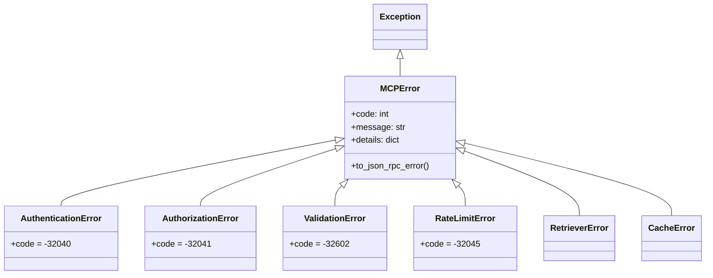
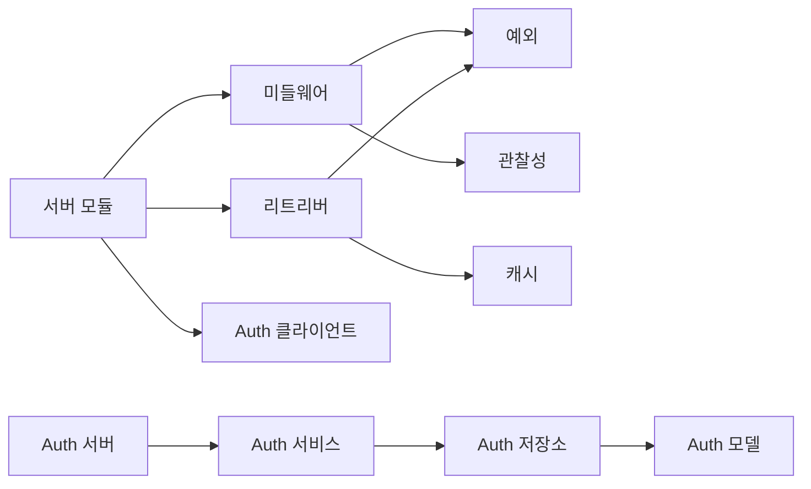
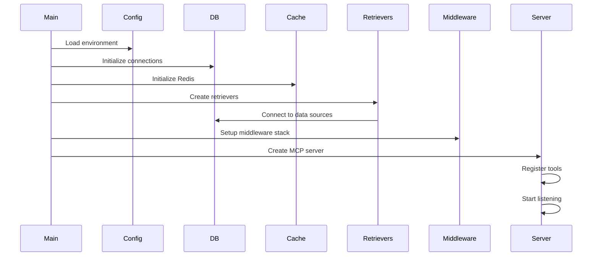

# src 폴더 구조

src 폴더는 MCP for Retriever의 모든 소스 코드를 포함합니다.

## 폴더 구조 개요

```mermaid
graph TD
    src[src/]
    src --> auth[auth/<br/>인증/인가 시스템]
    src --> cache[cache/<br/>캐싱 시스템]
    src --> middleware[middleware/<br/>미들웨어 스택]
    src --> observability[observability/<br/>관찰성]
    src --> retrievers[retrievers/<br/>리트리버 구현]
    src --> server[서버 파일들<br/>server*.py]
    src --> exceptions[exceptions.py<br/>예외 정의]
    
    auth --> auth_models[models.py<br/>데이터 모델]
    auth --> auth_db[database.py<br/>DB 스키마]
    auth --> auth_server[server.py<br/>FastAPI 서버]
    auth --> auth_services[services/<br/>비즈니스 로직]
    auth --> auth_repos[repositories/<br/>데이터 접근]
    
    cache --> redis_cache[redis_cache.py<br/>Redis 구현]
    
    middleware --> mw_auth[auth.py<br/>인증]
    middleware --> mw_log[logging.py<br/>로깅]
    middleware --> mw_rate[rate_limit.py<br/>속도 제한]
    middleware --> mw_val[validation.py<br/>검증]
    middleware --> mw_metrics[metrics.py<br/>메트릭]
    middleware --> mw_error[error_handler.py<br/>에러 처리]
    middleware --> mw_obs[observability.py<br/>추적]
    
    observability --> telemetry[telemetry.py<br/>OpenTelemetry]
    observability --> sentry[sentry_integration.py<br/>Sentry]
    
    retrievers --> base[base.py<br/>추상 인터페이스]
    retrievers --> tavily[tavily.py<br/>웹 검색]
    retrievers --> qdrant[qdrant.py<br/>벡터 DB]
    retrievers --> postgres[postgres.py<br/>RDB]
    retrievers --> factory[factory.py<br/>팩토리]
    retrievers --> cached[cached_base.py<br/>캐싱 래퍼]
```

## 주요 파일 설명

### 서버 구현 파일들

#### 1. `server.py`
- **목적**: 기본 MCP 서버 구현
- **주요 기능**:
  - FastMCP 서버 초기화
  - 도구 엔드포인트 정의
  - 기본 리트리버 통합

#### 2. `server_with_cache.py`
- **목적**: 캐싱이 통합된 MCP 서버
- **주요 기능**:
  - Redis 캐시 통합
  - 캐시된 리트리버 사용
  - TTL 기반 캐시 관리

#### 3. `server_improved.py`
- **목적**: 컨텍스트와 에러 처리가 개선된 서버
- **주요 기능**:
  - 사용자 컨텍스트 관리
  - 향상된 에러 처리
  - 요청 추적

#### 4. `server_auth.py`
- **목적**: 인증이 완전히 통합된 프로덕션 서버
- **주요 기능**:
  - FastMCP Bearer 토큰 인증
  - 내부 API 키 지원
  - 미들웨어 스택 통합

### exceptions.py

사용자 정의 예외 계층 구조:

## 모듈 간 의존성

## 초기화 순서

## 설정 및 환경 변수

각 모듈은 환경 변수를 통해 설정됩니다:

- **인증**: `JWT_SECRET_KEY`, `MCP_INTERNAL_API_KEY`
- **데이터베이스**: `POSTGRES_DSN`, `QDRANT_HOST`, `REDIS_HOST`
- **외부 API**: `TAVILY_API_KEY`
- **관찰성**: `OTEL_EXPORTER_OTLP_ENDPOINT`, `SENTRY_DSN`
- **성능**: `RATE_LIMIT_REQUESTS_PER_MINUTE`, `CACHE_TTL_SECONDS`

## 개발 가이드

### 새로운 기능 추가 시

1. 적절한 모듈에 코드 추가
2. 필요한 경우 새로운 예외 클래스 정의
3. 미들웨어가 필요한 경우 미들웨어 스택에 추가
4. 단위 테스트 작성
5. 통합 테스트 업데이트

### 코드 스타일

- Python 3.12+ 기능 활용
- 타입 힌트 필수
- async/await 패턴 사용
- 구조화된 로깅 (structlog)