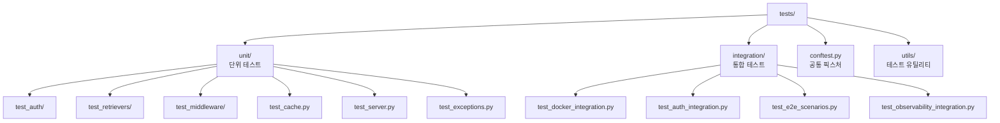
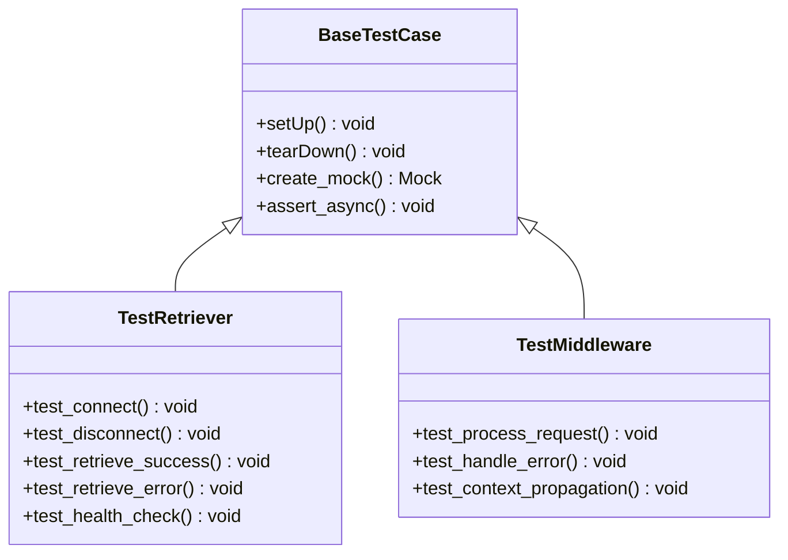
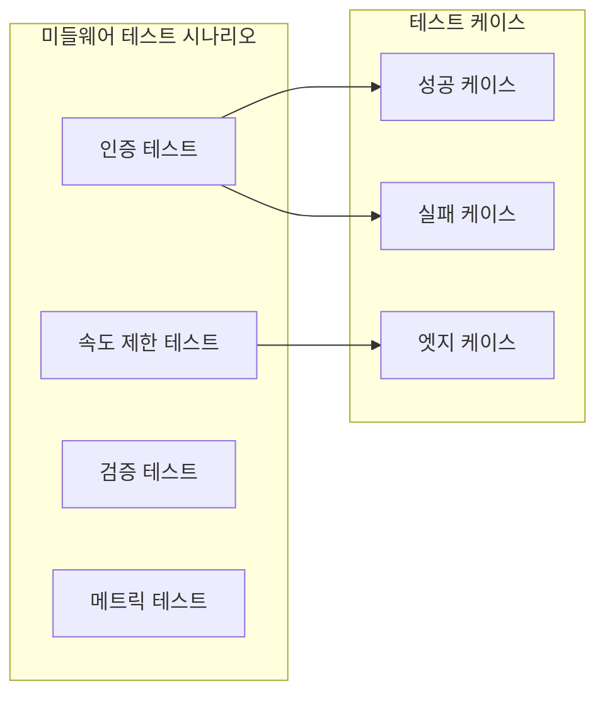
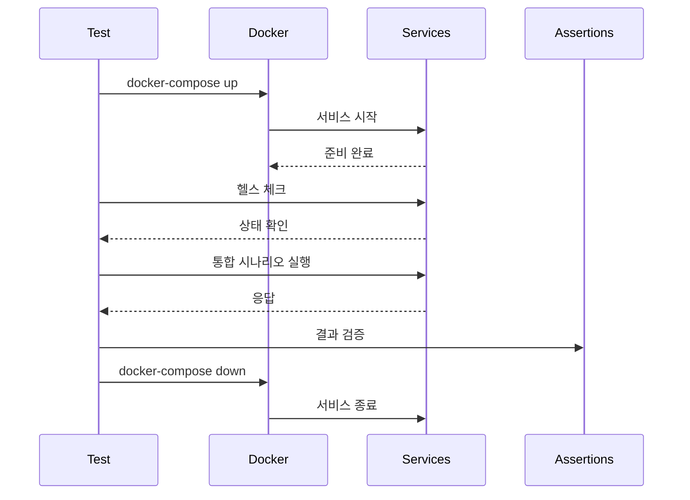
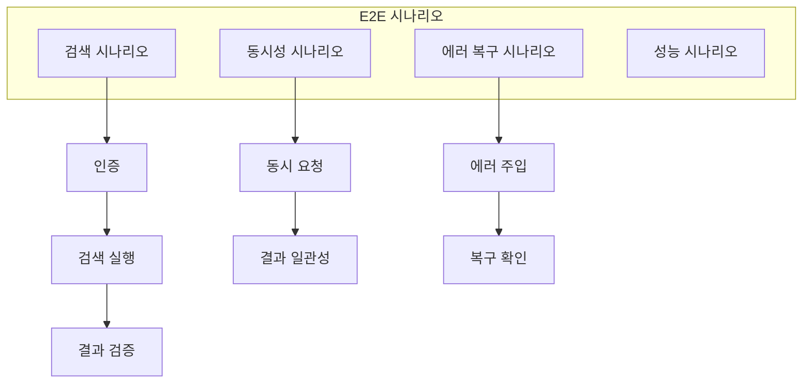

# Tests 구조

테스트는 단위 테스트와 통합 테스트로 구성되어 있으며, pytest 프레임워크를 사용합니다.

## 테스트 구조 개요



## 단위 테스트

### 1. 테스트 구조 패턴



### 2. 리트리버 테스트 (test_retrievers/)

```python
class TestTavilyRetriever:
    """Tavily 리트리버 단위 테스트"""
    
    @pytest.fixture
    async def retriever(self):
        """테스트용 리트리버 생성"""
        config = TavilyConfig(api_key="test-key")
        retriever = TavilyRetriever(config)
        await retriever.connect()
        yield retriever
        await retriever.disconnect()
    
    @pytest.mark.asyncio
    async def test_search_success(self, retriever, mock_tavily_response):
        """성공적인 검색 테스트"""
        # Given
        query = "test query"
        
        # When
        results = [r async for r in retriever.retrieve(query)]
        
        # Then
        assert len(results) > 0
        assert all("content" in r for r in results)
```

### 3. 미들웨어 테스트 (test_middleware/)



#### AuthMiddleware 테스트

```python
class TestAuthMiddleware:
    @pytest.fixture
    def middleware(self, mock_jwt_service, mock_user_service):
        return AuthMiddleware(
            jwt_service=mock_jwt_service,
            user_service=mock_user_service,
            internal_api_key="test-key"
        )
    
    async def test_jwt_validation_success(self, middleware):
        """JWT 토큰 검증 성공 테스트"""
        request = {
            "headers": {"authorization": "Bearer valid-token"},
            "method": "tools/call"
        }
        
        response = await middleware(request, mock_call_next)
        assert "user" in request
        assert response["status"] == "success"
```

### 4. 캐시 테스트

```python
class TestRedisCache:
    """Redis 캐시 단위 테스트"""
    
    @pytest.fixture
    async def cache(self, redis_mock):
        """Mock Redis 클라이언트 사용"""
        cache = RedisCache(CacheConfig())
        cache.redis_client = redis_mock
        return cache
    
    async def test_cache_hit(self, cache):
        """캐시 히트 테스트"""
        # Given
        key = "test:key"
        expected_value = {"data": "test"}
        cache.redis_client.get.return_value = json.dumps(expected_value)
        
        # When
        result = await cache.get(key)
        
        # Then
        assert result == expected_value
        cache.redis_client.get.assert_called_once_with(key)
```

## 통합 테스트

### 1. Docker 통합 테스트



### 2. 인증 플로우 테스트

```python
class TestAuthIntegration:
    """인증 통합 테스트"""
    
    @pytest.fixture
    async def auth_client(self):
        """인증 클라이언트 생성"""
        async with httpx.AsyncClient(base_url="http://localhost:8000") as client:
            yield client
    
    async def test_full_auth_flow(self, auth_client):
        """전체 인증 플로우 테스트"""
        # 1. 회원가입
        register_response = await auth_client.post(
            "/auth/register",
            json={"email": "test@example.com", "password": "Test123!"}
        )
        assert register_response.status_code == 201
        
        # 2. 로그인
        login_response = await auth_client.post(
            "/auth/login",
            json={"email": "test@example.com", "password": "Test123!"}
        )
        assert login_response.status_code == 200
        token = login_response.json()["access_token"]
        
        # 3. 인증된 요청
        me_response = await auth_client.get(
            "/auth/me",
            headers={"Authorization": f"Bearer {token}"}
        )
        assert me_response.status_code == 200
        assert me_response.json()["email"] == "test@example.com"
```

### 3. E2E 시나리오 테스트



### 4. 관찰성 통합 테스트

```python
class TestObservabilityIntegration:
    """관찰성 기능 통합 테스트"""
    
    async def test_trace_propagation(self, instrumented_client):
        """추적 컨텍스트 전파 테스트"""
        # 부모 스팬 생성
        with tracer.start_as_current_span("test_parent") as parent:
            # 요청에 추적 컨텍스트 주입
            headers = {}
            inject_trace_context(headers)
            
            # API 호출
            response = await instrumented_client.post(
                "/mcp/",
                headers=headers,
                json={"method": "tools/list"}
            )
            
            # 추적 확인
            assert "traceparent" in response.headers
            assert parent.context.trace_id in response.headers["traceparent"]
```

## 테스트 픽스처 (conftest.py)

### 공통 픽스처

```python
@pytest.fixture(scope="session")
def event_loop():
    """이벤트 루프 픽스처"""
    loop = asyncio.get_event_loop_policy().new_event_loop()
    yield loop
    loop.close()

@pytest.fixture
async def mock_retriever():
    """Mock 리트리버"""
    retriever = AsyncMock(spec=Retriever)
    retriever.retrieve.return_value = async_generator([
        {"id": "1", "content": "test"}
    ])
    return retriever

@pytest.fixture
def mock_jwt_service():
    """Mock JWT 서비스"""
    service = Mock()
    service.decode.return_value = {
        "sub": "user-123",
        "email": "test@example.com"
    }
    return service
```

### 데이터베이스 픽스처

```python
@pytest.fixture
async def test_db():
    """테스트 데이터베이스"""
    # 테스트 DB 생성
    async with create_engine(TEST_DATABASE_URL) as engine:
        async with engine.begin() as conn:
            await conn.run_sync(Base.metadata.create_all)
        
        yield engine
        
        # 정리
        async with engine.begin() as conn:
            await conn.run_sync(Base.metadata.drop_all)
```

## 테스트 유틸리티

### 비동기 테스트 헬퍼

```python
async def async_generator(items):
    """리스트를 비동기 제너레이터로 변환"""
    for item in items:
        yield item

def async_return(value):
    """값이 반환되는 비동기 함수 생성"""
    async def _return():
        return value
    return _return()
```

### 테스트 데이터 빌더

```python
class TestDataBuilder:
    """테스트 데이터 생성 헬퍼"""
    
    @staticmethod
    def create_user(**kwargs):
        defaults = {
            "id": str(uuid4()),
            "email": "test@example.com",
            "role": UserRole.USER
        }
        return User(**{**defaults, **kwargs})
    
    @staticmethod
    def create_search_result(**kwargs):
        defaults = {
            "id": str(uuid4()),
            "content": "Test content",
            "score": 0.95
        }
        return {**defaults, **kwargs}
```

## 테스트 실행

### 명령어

```bash
# 모든 테스트 실행
pytest

# 특정 모듈 테스트
pytest tests/unit/test_retrievers/

# 마커별 실행
pytest -m "not slow"
pytest -m "integration"

# 커버리지 포함
pytest --cov=src --cov-report=html

# 병렬 실행
pytest -n auto

# 상세 출력
pytest -vvs
```

### 테스트 마커

```python
# 느린 테스트
@pytest.mark.slow
async def test_large_dataset():
    pass

# 통합 테스트
@pytest.mark.integration
async def test_full_system():
    pass

# Docker 필요
@pytest.mark.docker
async def test_with_docker():
    pass
```

## 테스트 전략

### 1. 단위 테스트
- 모든 public 메서드 테스트
- 경계값 테스트
- 예외 케이스 테스트
- Mock 사용으로 격리

### 2. 통합 테스트
- 실제 서비스 간 상호작용
- 데이터 흐름 검증
- 성능 특성 확인
- 에러 시나리오

### 3. E2E 테스트
- 사용자 시나리오
- 전체 시스템 검증
- 실제 환경과 유사
- 회귀 테스트

## 테스트 커버리지

### 목표 커버리지

```
src/
├── auth/          > 90%
├── cache/         > 85%
├── middleware/    > 95%
├── retrievers/    > 90%
├── server*.py     > 80%
└── overall        > 85%
```

### 커버리지 리포트

```bash
# HTML 리포트 생성
pytest --cov=src --cov-report=html

# 콘솔 리포트
pytest --cov=src --cov-report=term-missing

# XML 리포트 (CI/CD용)
pytest --cov=src --cov-report=xml
```

## CI/CD 통합

### GitHub Actions 예제

```yaml
name: Tests
on: [push, pull_request]

jobs:
  test:
    runs-on: ubuntu-latest
    steps:
      - uses: actions/checkout@v3
      - name: Set up Python
        uses: actions/setup-python@v4
        with:
          python-version: '3.12'
      - name: Install dependencies
        run: |
          pip install uv
          uv sync
      - name: Run tests
        run: |
          uv run pytest --cov=src --cov-report=xml
      - name: Upload coverage
        uses: codecov/codecov-action@v3
```