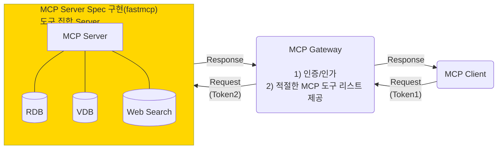
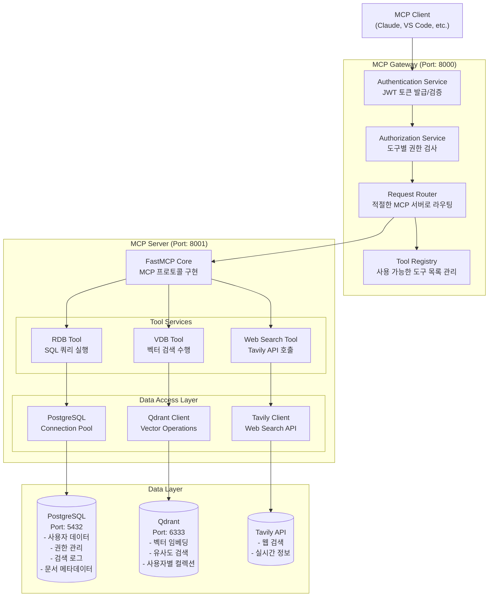

# 전체 아키텍처 구성도



## 1. MCP Gateway(Authentication/Authorization)

### FastAPI 기반 인증 서버

- JWT 토큰 기반 인증/인가
- MCP 도구 권한 관리
- Rate Limiting & Request Validation

주요 컴포넌트

- Authentication Service (JWT)
- Authorization Service (RBAC)
- MCP Tool Registry
- Request Router

## 2. MCP Server (FastMCP Library Implementation)

### FastMCP 라이브러리 기반 MCP 서버

- 다중 Retriever 도구 통합
- 비동기 처리
- 상태 관리

도구별 서비스:

- RDB Tool Service

 > tool list, search-query
 > MUST **Elicitation**: create, delete, update

- VDB Tool Service  

 > tool list, search-query
 > MUST **Elicitation**: create, delete, update

- Web Search Tool Service

 > tool list, search-query

## 데이터 아키텍처

### PostgreSQL 데이터베이스 스키마

```sql
-- 사용자 데이터
CREATE TABLE users (
    id SERIAL PRIMARY KEY,
    email VARCHAR(255) UNIQUE NOT NULL,
    password_hash VARCHAR(255) NOT NULL,
    created_at TIMESTAMP DEFAULT NOW(),
    updated_at TIMESTAMP DEFAULT NOW()
);

-- MCP 토큰 관리
CREATE TABLE mcp_tokens (
    id SERIAL PRIMARY KEY,
    user_id INTEGER REFERENCES users(id),
    token_hash VARCHAR(255) NOT NULL,
    expires_at TIMESTAMP NOT NULL,
    is_active BOOLEAN DEFAULT TRUE,
    created_at TIMESTAMP DEFAULT NOW()
);

-- 도구 사용 권한
CREATE TABLE user_tool_permissions (
    id SERIAL PRIMARY KEY,
    user_id INTEGER REFERENCES users(id),
    tool_name VARCHAR(100) NOT NULL,
    is_allowed BOOLEAN DEFAULT TRUE,
    created_at TIMESTAMP DEFAULT NOW()
);

-- 검색 히스토리 및 로그
CREATE TABLE search_logs (
    id SERIAL PRIMARY KEY,
    user_id INTEGER REFERENCES users(id),
    tool_used VARCHAR(100) NOT NULL,
    query TEXT NOT NULL,
    response_size INTEGER,
    execution_time_ms INTEGER,
    created_at TIMESTAMP DEFAULT NOW()
);

-- 문서 메타데이터 (벡터DB와 연결)
CREATE TABLE documents (
    id SERIAL PRIMARY KEY,
    user_id INTEGER REFERENCES users(id),
    title VARCHAR(500),
    content_type VARCHAR(100),
    file_path TEXT,
    vector_id VARCHAR(255), -- Qdrant의 point ID
    created_at TIMESTAMP DEFAULT NOW(),
    updated_at TIMESTAMP DEFAULT NOW()
);
```

### Qdrant 벡터DB 스키마

1. Collection 구성

collection_config = {
    "vectors": {
        "size": 1536,  # OpenAI ada-002 embedding size
        "distance": "Cosine"
    },
    "payload_schema": {
        "user_id": "integer",
        "document_id": "integer",
        "title": "text",
        "content": "text",
        "metadata": {
            "source": "text",
            "created_at": "datetime",
            "tags": ["text"]
        }
    }
}

2. 인덱스 전략

- user_id 필드에 인덱스 생성 (사용자별 격리)
- 계층적 네비게이션을 위한 HNSW 인덱스
- 필터링을 위한 payload 인덱스

## 상세한 컴포넌트 아키텍처


